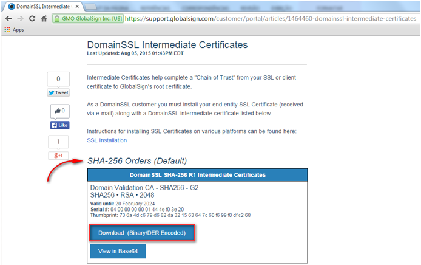
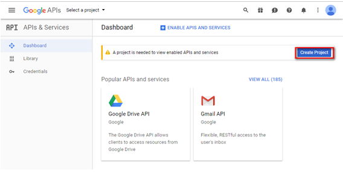
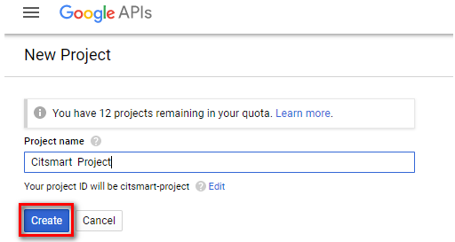
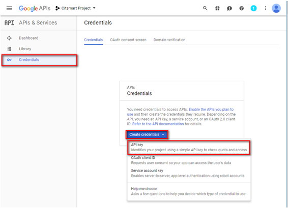
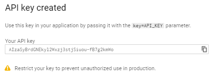
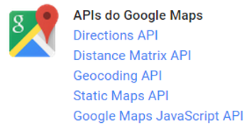
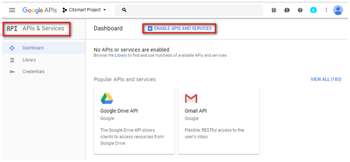
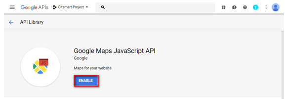

title: Configure instance to use CITSmart FS application
Description: Intended to provide guidance for configuring the server for using CITSmart ITSM Enterprise mobile application (iOS and Android plataform).
#CConfigure instance to use CITSmart FS application

This document is intended to provide guidance for configuring the server for
using CITSmart ITSM Enterprise mobile application (iOS and Android plataform).

Before getting starded
----------------------

It’s necessary to have the Deploy CITSmart Enterprise Web in version 7.2.2.0
or higher, setup the parameters 257 and 272 must be:

  + Values: "Y" or "N" Default: "N";

  + If the value of the parameter is "Y", only notifications of requests without
    a current controller can be shown;

  + If the value of the parameter is "N", notifications of all the requests can
    be shown.

The parameters 254 (system parametrization), 255, 256, 258, 267, 284, 285, 286,
350 also must be configurated.

Configuring web services
------------------------

Configure CITSmart Enterprise Web Services to access the functionality of the
CITSmart ITSM Enterprise application.

1.  On CITSmart Enterprise Web, access the Web Services feature for the mobile
    (System > Settings > Mobile > Citsmart Mobile Web Service);

2.  Click on the "Link Groups" tab and link the activity executing group to the
    CITSmart ITSM Enterprise Web Services.

!!! Abstract "RULE"

    At the time the group is selected, it will be linked to all CITSmart ITSM
    Enterprise Web Services in an automated way.  

Installing globalsign intermediate certificate
----------------------------------------------

In order to recognize the intermediate certificate of the GlobalSign (Digital
Certification Issuer), it must be installed. Follow the procedures below:

1.  Access
    address: <https://support.globalsign.com/customer/portal/articles/1464460-domainssl-intermediate-certificates>;

2.  Download the first certificate, as shown in the figure below:

    

    Figure 1 - GlobalSign intermediate certificate

      +  **On mobile**: you will be asked to install the certificate, just enter the
      generic name (suggestion: GlobalSign) and click on forward.

      +  **In desktop**: right-click the downloaded certificate (as shown below),
      click on install certificate, and proceed to finish.

    

    Figure 2 - Certificate installation on desktop

3.  Once installed, simply change the application's address to
    “<https://citsmart.centralit.com.br/citsmart>”.

Android app installation
------------------------

1.  Go to Google Play (Play Store) to download the Citsmart Enterprise Mobile
    application;

2.  Search for Citsmart Enterprise and after the search, select the application;

3.  Press the “Install” button to download the application.

Creating key for use and consumption of Google APIs
---------------------------------------------------

In order for the use and consumption of the Google APIs to be possible, a Key
API must be created. For this, the following steps must be followed:

!!! Abstract "ATTENTION"

    To peform these procedures, you must be logged in with a Google account.  

1.  Go to the Google Developer
    Console [https://console.developers.google.com](https://console.developers.google.com/);

2.  Click “Create project”, as shown in the figure below:

    

    Figure 3 - Google developer console

3.  A window will appear, as shown in the figure below, to inform the data of
    the new project;

    

    Figure 4 - Project creation screen

4.  Enter the name of the project and click the Create button to create the
    project.

5.  After creating the project, click APIs and Services. To create the API Key,
    click APIs and Services > Credentials > Create Credentials > API Key, as
    shown in the figure below:

    

    Figure 5 - API Key creation screen

6.  Once this is done, the API key will be displayed:

    

    Figure 6 - API Key options screen for creation

7.  Choose the men option that best suits you. For more information on which key
    will answer you, go
    to [https://developers.google.com/console/help/new/\#generatingdevkeys](http://developers.google.com/console/help/new/#generatingdevkeys)

8.  After the keys are created, the APIs can already be consumed.

### APIs to be used in the solutions

Below are the Google APIs to consider in the solutions:

Figure 7 - APIs

 +   Directions API: the Google Directions API is consumed through HTTP
    requests. This API calculates directions between two points informed, the
    source and the destination, having several other options.

    +  For more information about using this API,
        access: <https://developers.google.com/maps/documentation/directions>.

 +   Distance Matrix API: the Google Distance Matrix API allows the retrieval
    of arrays of distances between two points, that is, returns approximate
    result as well. The difference for the Google Directions API is that the
    Distance Matrix does not return such detailed information as the steps to be
    performed.

    +  For more information about using this API,
        access: <https://developers.google.com/maps/documentation/distancematrix>.

 +   Geocoding API: the Google geocoding API is an API that helps you
    retrieve geographic positions by sending an extended address as an argument.
    The consumption of the API is done by HTTP and the results can be obtained
    in XML or JSON.

    +   For more information about using this API,
        access: <https://developers.google.com/maps/documentation/geocoding>.

+   Statics Maps API: the Google Static Maps API will be used in cases where
    interaction will not be required as a map, only view. It is interesting to
    use since it is lighter, since it is not necessary to download JS resource
    and images that will not be used.

    +   For more information about using this API,
        access: <https://developers.google.com/maps/documentation/staticmaps>.

+   Google Maps JavaScript API: the use of the API is done through a JS API.
    For your use, simply link to JS on the page that will use the maps.

    +   For more information about using this API,
        access: <https://developers.google.com/maps/documentation/javascript>

Activating an API
-----------------

To enable an API for use, proceed as described below:

1.  After performing the steps described in the section 'Creating key for use
    and consumption of Google APIs';

2.  Click APIs and Services > Enable APIs and Services, as shown in the figure
    below:

    

    Figure 8 - Google APIs

3.  The API library will be displayed. Select the API you want to enable (the
    figure below represents an example of API) and click the "Activate API" button
    as indicated in the figure below:

    

    Figure 9 - Google APIs activation

4.  Once this is done, the API will be enabled for use.

Related
-------

[Configure parametrization - mobile](/en-us/citsmart-esp-8/platform-administration/parameters-list/configuration-parametrization-mobile.html)

[Cofigure parametrization - system](/en-us/citsmart-esp-8/platform-administration/parameters-list/configure-parametrization-system.html)

[Mobile CITSmart SM (Android) application manual](/en-us/citsmart-esp-8/additional-features/mobile-and-field-service/apps/citsmart-app-android.html)

[Mobile CITSmart SM (iOS) application manual](/en-us/citsmart-esp-8/additional-features/mobile-and-field-service/apps/citsmart-app-ios.html)

[Configure mobile options](/en-us/citsmart-esp-8/additional-features/mobile-and-field-service/configuration/configure-mobile-options.html)

!!! tip "About"

    <b>Product/Version:</b> CITSmart ESP | 8.00 &nbsp;&nbsp;
    <b>Updated:</b>01/11/2019 - Anna Martins

