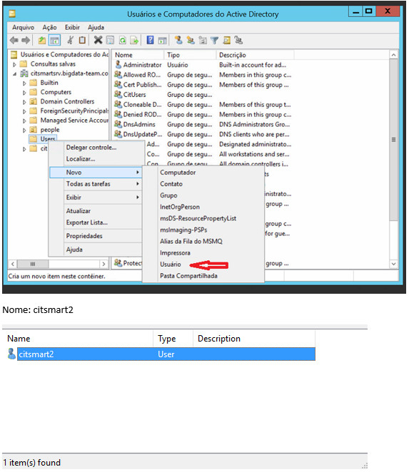
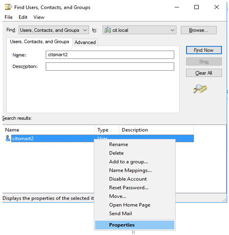
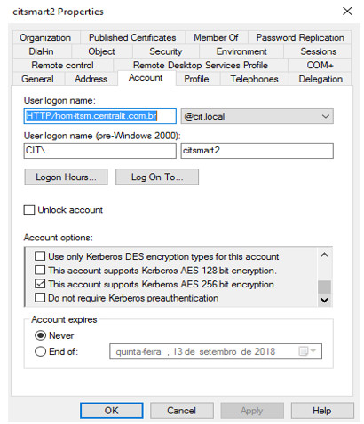

title: CITSmart auto-login
Description: CITSmart auto-login
#CITSmart auto-login


**Branchs**:

   Sso (itsm)

   Spnego 1.0 (artifactory)


Create user AD
----------------

1.  Access create user in Users and Computers of the Active Directory, as in the image below:

    

     Figure 1 - Create user

2. Create a password: 

    

     Figure 2 - Password

3. Click on the right side of the mouse, in the button user/properties:

    

     Figure 3 - Button user/properties

4. Select the option "This account osupports 256 bit encryption", apply it and check "OK", as below:

    

     Figure 4 - Configure account


5.  Open the ADSI Edit. Then, connect in the AD, click on users and locate the user newly created, as below:
      
    

     Figure 5 - Verifying user

6.  Click with the right button of the mouse and select the option Properties. Then, search for the **servicePrincipalName** (SPN);

7.  Add HTTP/hom-itsm.centralit.com.br, click on OK, as in the image below:

    

     Figure 6 - Add value

8.  Open the CMD as Administrator and put the following commands. Remember that the first sets the SPN and the second creates the Keytab (which will be used in the Wildfly):

    -   setspn -s HTTP/hom-itsm.centralit.com.br citsmart2

    -   ktpass / princ HTTP/hom-itsm.centralit.com.br /mapuser citsmart2  /pass
        central\@123 /ptype KRB5_NT_Principal/outcitsmart2.keytab /crypto ALL

9.  Making the steps above, the AD will be configured. 


Configure the Wildfly server
-----------------------------

1.  Copy the **war** generated from the branch **sso**;

2.  Copy the file krb5.conf (validate the information according to the AD) to the folder standalone/configuration (wildfly):
    
    ```sh
    [libdefaults]
    default_tkt_enctypes = aes256-cts-hmac-sha1-96 aes128-cts-hmac-sha1-96 rc4-hmac
    default_tgs_enctypes = aes256-cts-hmac-sha1-96 aes128-cts-hmac-sha1-96 rc4-hmac
    permitted_enctypes = aes256-cts-hmac-sha1-96 aes128-cts-hmac-sha1-96 rc4-hmac
    [realms]
    ```
    
    ```sh
    citgosrv004.cit.local  = {
    kdc = citsmartsrv.citsmartsrv.bigdata-team.com
    default_domain = citsmartsrv.citsmartsrv.bigdata-team.com }     
    ```
    
    ```sh
    [domain_realm]
    .citsmartsrv.citsmartsrv.bigdata-team.com = citsmartsrv.citsmartsrv.bigdata-team.com
    ```

1.  Copy the file login.conf (validate the information according to the AD) to the folder standalone / configuration (wildfly)::

    ```sh
    custom-client {
    com.sun.security.auth.module.Krb5LoginModule required
    storeKey=true
    useKeyTab=true
    keyTab="file:///opt/wildfly-12.0.0.Final/standalone/configuration/lightkeytab.keytab"
    principal=HTTP/light-desenvolvimento.citsmartcloud.com\@CITSMARTSRV.BIGDATA-TEAM.COM;
    };
    ```

1.  Copy the lightkeytab.keytab file (generated by the command in AD) to the standalone / configuration (wildfly) folder;

2.  Fix standalone.xlm by adding the following information:

    In **\<system-properties\>**
    
    ```java
    \<property name="sun.security.krb5.debug" value="true"/\>
    \<property name="java.security.krb5.kdc" value="CITSMARTSRV.BIGDATA-TEAM.COM"/\>
    \<property name="java.security.krb5.realm"value="CITSMARTSRV.BIGDATA-TEAM.COM"/\>
    \<property name="java.security.krb5.conf"value="/opt/wildfly-12.0.0.Final/standalone/configuration/krb5.conf"/\>
    \<property name="java.security.auth.login.config"value="/opt/wildfly-12.0.0.Final/standalone/configuration/login.conf"/\>
    \<property name="krb.keyTab"value="/opt/wildfly-12.0.0.Final/standalone/configuration/lightkeytab.keytab"/\>
    \<property name="krb.principal"value="HTTP/light-desenvolvimento.citsmartcloud.com\@CITSMARTSRV.BIGDATA-TEAM.COM"/\>
    ```
    
    In **\<security-domains\>**

    ```java
    \<security-domain name="spnego-server"\>
    \<authentication\>
    \<login-module code="com.sun.security.auth.module.Krb5LoginModule"flag="required"\>
    \<module-option name="storeKey" value="true"/\>
    \<module-option name="useKeyTab" value="true"/\>
    \<module-option name="keyTab" value="\${krb.keyTab}"/\>
    \<module-option name="principal" value="\${krb.principal}"/\>
    \<module-option name="isInitiator" value="false"/\>
    \</login-module\>
    \</authentication\>
    \</security-domain\>
    \<security-domain name="SPNEGO" cache-type="default"\>
    \<authentication\>
    \<login-module code="Kerberos" flag="required"\>
    \<module-option name="storeKey" value="true"/\>
    \<module-option name="refreshKrb5Config" value="true"/\>
    \<module-option name="useKeyTab" value="true"/\>
    \<module-option name="doNotPrompt" value="true"/\>
    \</login-module\>
    \</authentication\>
    \</security-domain\>
    ```

1.  If you don't have changed the jar of policy of JAVA (JCE - Java Cryptography Extension), download the files and put in jdk/jre/lib/security/policy/limited and jdk/jre/lib/security/policy/unlimited;

2.  Import (synchronize) users of LDAP in ITSM.

!!! Abstract "ATTENTION"

    The DN Alias should be the same as the network domain (example: CIT\user), log the DN Alias = CIT, as below:


   Figure 7 - Define DN

!!! Abstract "ATTENTION"

    It's recommended the reading the follow support materials: https://ss64.com/nt/setspn.html and http://spnego.sourceforge.net/ .
    
    
!!! tip "About"

    <b>Product/Version:</b> CITSmart ESP | 8.00 &nbsp;&nbsp;
    <b>Updated:</b>03/15/2019 – Anna Martins

   
