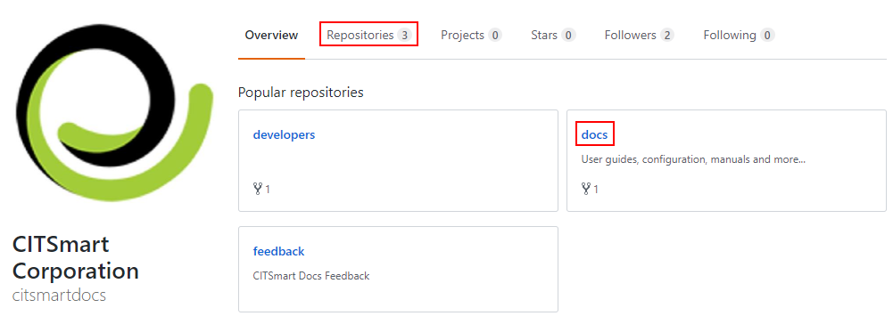

Title: CITSmart Docs Contribution Guide

# CITSmart Docs Contribution Guide

CITSmart Docs is an incessant work of documentation of our products. We understand that the experience of our community in using the platform is the most enriching part. So here we explain how you can contribute to our documentation in a transparent and open way.

CITSmart documentation is publicly available on [GitHub](https://github.com/citsmartdocs/). It's through it that you will be able to edit existing documents, create new documents or even suggest improvements to our portal.

Thank you for accessing the CITSmart Docs contribution page.

## Editing existing documents

 

One of the ways to contribute is by editing existing documents in our repository. Suggestion of minor technical or grammatical errors are quite common using this simple and quick method.

To beging with:

 

1) Access the CITSmart document repository on GitHub: https://gitbub.com/citsmartdocs.

2) Click on "Sign In" at the top of the page and enter a username and password.

 

 

 

If you don't have an username and password, and want to contribute, click on "Sign Up" to create a new account.

The creation of an user on the Github platform is free.

 

!!! Warning "NOTE"

 

    The GitHub user and password is the responsibility of the website. We have no control over creating users on the platform.

 

3) After the login, click on "Repositories" or "docs" as shown below:

 

 

4) After accessing the docs repository, you will find our documentation separated by folders in languages. Choose the folder and documentation you want to contribute, and click on "Edit":

 

 

5) From that point on, you'll be able to edit the document if you're logged in. Our documents are made using a syntactic language called Markdown.

Markdown allows users without programming language knowledge to write documents in HTML format. It's a simple language made for end users.

Follow our [Markdown writing guide](https://docs.citsmart.com/pt-br/markdown.html) to find out how to write our documents.

 

Click on "Preview changes" if you want to follow the progress of the document writing and how it will look after the Markdown format conversion.

 

!!! Warning "NOTE"

 

    Not all markdown formatting is possible to preview in Github, although several visual elements are perfectly applicable.

               

6) When you finish editing the document you want, put your comments in the "Propose file change" fields and click on "Propose file change".

In the next step will appear the button "Create pull request". Click on it to submit your suggestion.

 

The team will evaluate your proposal for change, and after approval of the content this will be available in our documentation.

 
