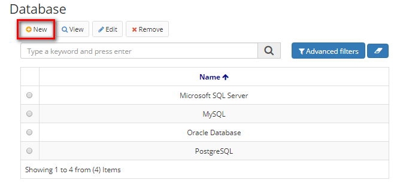

Title: Database  
Description:By using this screen the user can register the databases used by Neuro.

# Database  

By using this screen the user can register the databases used by Neuro.  

##How to access  

1. Access the feature by navigating the menu Neuro > Configuration > Database.  

##Preconditions  

1. Not applicable  

##Filters  

1. The following filter enables the user to restrict the participation of items in the standard feature listing, making it easier to find the desired items:  

     - Keyword    
 
     
 Figure 1 - Database search screen    
 
##Items list  
 
1. The following cadastral field is available to the user to make it easier to identify the desired items in the standard feature listing: Name.  

    
 Figure 2 - Database listing screen  
 
##Filling in the registration fields  
1. To register a database that is not in the list, click New, as shown in the figure bellow:  

        
     Figure 3 - Database home screen  

2. On this screen the user is also allowed other actions. They are:  
      - To edit a created item, select the desired item, click Edit, make the changes, and click Save.  
      - To view an item, select the item and click View.  
      - To remove a created item, select the item you want, click Remove, and confirm the deletion.  
3. When you click Next, the following screen will appear:  

        
    Figure 4 - Database register screen  

4. Enter the database type, the driver path, and select the Data type that are accepted by the registered database.  
5. The database types are pre-registered in the application. To learn more about registering data types, please refer to the relevant documentation.  
6. Click Save to create the database. Click Search to return to the previous screen.  

!!! tip "About"

    <b>Product/Version:</b> CITSmart Platform | 8.00 &nbsp;&nbsp;
    <b>Updated:</b>01/23/2019 - João Pelles  
