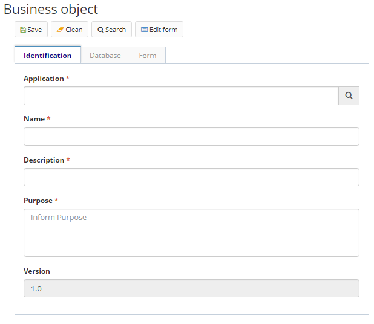
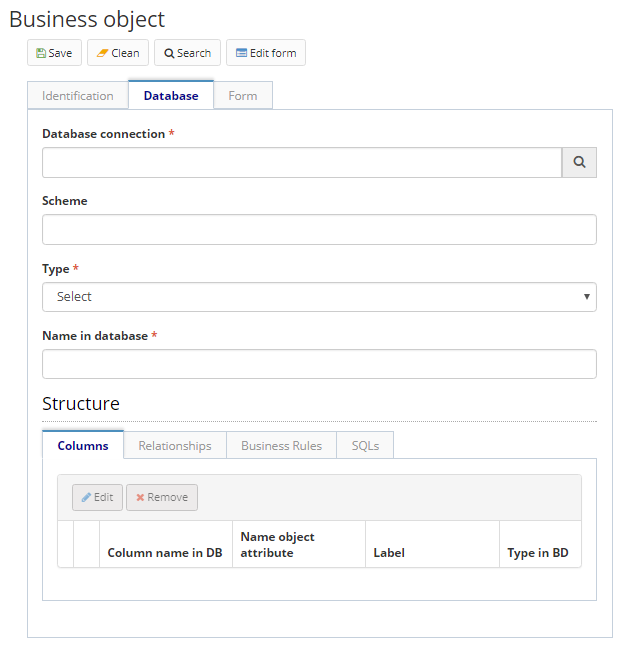
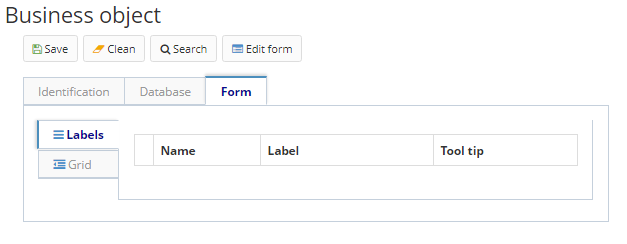

title: Business object  

Description: Through this screen, it is possible to keep the business objects of the applications. They are objects stored in the application database and represent the data model that may give rise to one or more forms

#Business object  

Through this screen, it is possible to keep the business objects of the applications. They are objects stored in the application database and represent the data model that may give rise to one or more forms.  
Every business object must have a primary key, however, not always the primary key will be created in the database. Business objects are created at the application level.  
Each business object created represents a table in the database.

##HOW TO ACCESS
1.	Access the functionality through navigation in the main menu Neuro → Management → Business Object.  

##PRECONDITIONS
1.	No applicable.  

##FILTERS
1.	The following filter enables the user to restrict the participation of items in the standard feature listing, making it easier to find the desired items:  
•	Keyword or enter.  

  
Figure 1 - Search screen of registered business objects

##ITEMS LIST
1.	The following cadastral fields are available to the user to facilitate the identification of the desired items in the standard feature listing: Application, Name, Description, Database connection and Version.  

  
Figure 2 - Listing screen of registered business objects

##FILLING IN THE REGISTRATION FIELDS
1.	To change a business object, click Edit;  
2.	To create a new business object, click New.  

##IDENTIFICATION
This tab should be fed as a way of identifying the business object created.  
1.	Enter the Application for which the business object is created (registered in menu Neuro →  Management →  Application);  
2.	 The business object identification name, description, purpose must be inform and mark whether the system should generate the form upon saving.  
3.	As you click Generate Form when saving, Neuro will generate a form based on the information entered in the database tab. This form can be edited later through menu Neuro → Management → Form.  

  
Figure 3 - Register/edit business object screen

##DATABASE
1.	This tab refers to the database structure of the application. Since each business object represents a database table, this tab defines the database columns as well as their relationships, business rules, and SQL commands (if necessary).  
2.	First, enter the database connection created, the database schema name, type, whether view or table, and the name of the business object in the database.  

  
Figure 4 - Register/edit business object, database tab

##FORM
1.	You can change the attribute labels through the Labels tab, and you can edit the grid fields using the Grid tab.  
2.	Clicking the Edit Form button in the screen header will generate a form for this business object. If there is no form for this business object, the Fields sidebar will be displayed. If there is already a previously registered form linked to this form, the Screen Drawing tab for this form will be opened.  
3.	Further information regarding Neuro's form creation can be found in the technical documentation.  

  
Figure 5 - Register/edit business object, form tab

