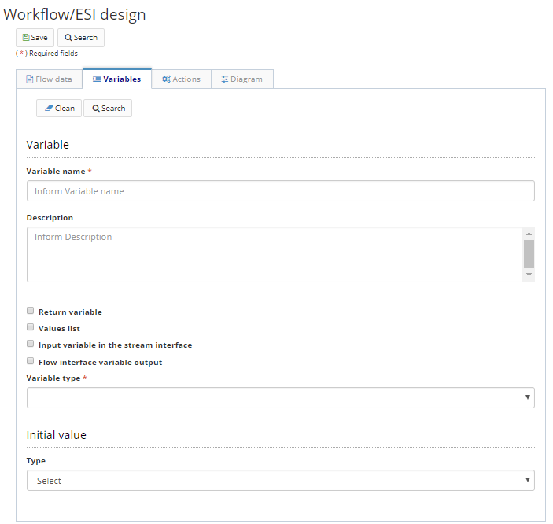
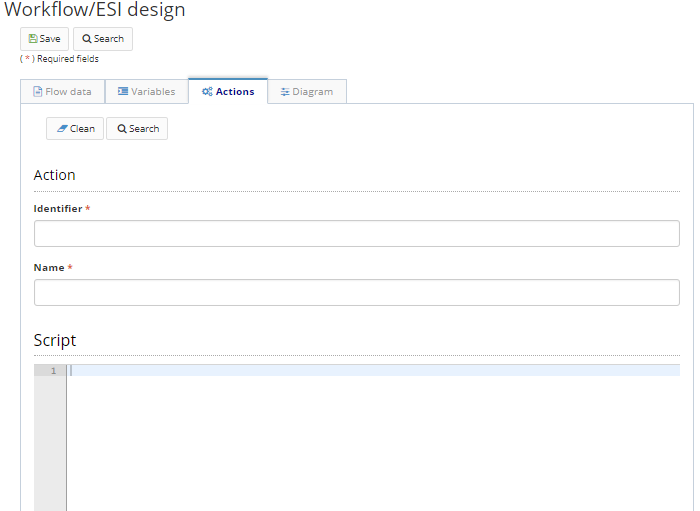
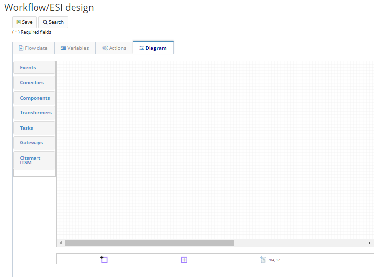

Title: Service Integration Flow  
Description:Service integration flows, as the name implies, involve workflows that are executed based on system services, such as integrations and conversions, for example.  
#Service Integration Flow   
Service integration flows, as the name implies, involve workflows that are executed based on system services, such as integrations and conversions, for example.  

##HOW TO ACCESS  

1- Access the functionality through the menu **Neuro → Management → ESI Flow.**   

##PRECONDITIONS  

1- Not applicable  

##FILTERS  

1- The following filter enables the user to restrict the participation of items in the standard feature listing, making it easier to find the desired items:  

- Keyword  

 
Figure 1 - Search screen   

##ITEMS LIST  

1- The following cadastral fields are available to the user to make it easier to identify the desired items in the standard feature listing: **Name, Description, Flow Application, Version**, and **Block date**.  

 
Figure 2 - Listing screen   

##FILLING IN THE REGISTRATION FIELDS - FLOW DATA  

Through this tab, all basic information about the flow to be design is defined.  

1- To add a new flow, click **New → Integration services flow**, as shown in the figure below:  

   
Figure 3 - Registration screen  

2- To add a new flow data, click Add.  
3- The following screen will be displayed:  

 
Figure 4 - Workflow registration / editing screen, Flow Data tab   

4- Enter a **name** for the flow, a **description**, which **form** will start the flow (if applicable), and whether or not flow execution will persist. If the field **"Keep running the stream"** is checked, Neuro will persist in the database on every instance of the execution of this flow.  

5- The field **version** is incremented automatically by the system whenever a new version of the workflow is created.  

##VARIABLES  

In this tab are configured the variables that will be used in the drawn flow. Variables are objects that can hold and represent a value or expression. Variables are associated with "names", called identifiers, during the runtime of the flow.  

1- To add a new variables, choose the tab for the same and then click Add.  
2- The following screen will be displayed:  

 
Figure 5 - Workflow registration / editing screen, Variables tab   

3- Fill in the fields:  

- Variable's name;  
- Description;  
- Whether it will be stored in the database;  
	- This option will store the value of the variable internally within the **Neuro** data model, so it will retain the value during the execution of the tasks  
- Whether it is a return variable;  
	- This option will cause **Neuro** to return the variable at the end of the flow run.  
- Whether it is a values list;  
- If it is an input variable in the flow interface;  
	- This option allows the variable to be "injected" into the business process linked to this flow.  
- If it is an output variable in the flow interface;  
	- This option causes the variable to have the value filled when the business process bound to the flow is executed.  
- The variable type;  
	- If it is a Java object, enter the corresponding Java class;  
	- If it is a business object, inform what its respective application is and what the registered name of the business object;  
- The initial value of the variable, whether constant or script.  
	- If the value is a constant, it will never be changed during the flow execution, regardless of the operations performed by the user.  

4- To edit a variable, select the desired variable, click Edit, make the necessary changes, and click Update to complete the edit.  

5- To remove a variable flow, select the desired variable, click Remove, and confirm the deletion.  

!!! Abstract "ATTENTION"  

    **To save the changes effectively, click Save on the top bar.**  

##ACTIONS  

Through this menu, it is possible to register the actions that will be run in the workflow.  

The actions are based on scripts programmed in Rhino language.  

	1- To include an action, choose the tab for the same and then click go to Add.  
	2- The following screen will be displayed:  

 
Figure 6 - Register/edit workflow, actions tab 

3- Fill in the fields:  

- an identifier for the action;  
- the literal name for the action;  
- and the script that will be run when the action is triggered.  

4- To edit an action, select the action you want, click Edit, make the necessary changes, and click Update to complete the edit.  

5- To remove an action, select the action, click Remove, and confirm the deletion.  

!!! Abstract "ATTENTION"  

    **To save the changes effectively, click Save on the top bar.**  

##DIAGRAM  

The diagram of a service flow does not have the same "Task" components as a process flow. I.e., you cannot use the "Human Task" components for "Sub Process Workflow".  

For a business process, we have, in addition, these components sections:  

	- Connectors: components used to perform operations related to the database.  
	- Components: varied components for performing various tasks.  
	- Transformers: components for converting variable types.  
	- CITSmart: components used for integration with an external Citsmart system.  
	- The other components present in the palette resemble the components of a "Process Flow". Further information regarding the functionality and use of each of the components can be found in the Developing Applications.  

1- To design a diagram, choose the tab for the same  
2- The following screen will be displayed:  

 
Figure 7 - Register/edit workflow, diagram tab

