title: CITSmart Enterprise ITSM Mobile application user guide (Android)
Description: is intended to provide guidance for installing, configuring, and using the CITSmart Enterprise (Android mobile from Play Store) application.
#CITSmart Enterprise ITSM Mobile application user guide (Android)

This document is intended to provide guidance for installing, configuring, and
using the CITSmart Enterprise (Android mobile from Play Store) application.

The CITSmart Enterprise (Android mobile from Play Store) offers several
features, including:

1.  Facility in service and have a direction of where the request is located;

2.  Filter personal and work group requests;

3.  Viewing the details of a service request;

4.  Viewing requests on map;

5.  Visualization of the best route to arrive at the place of service requesting
    service;

6.  Updating the location of the latitude longitude unit from the mobile device;

7.  Check-out if the user has execution permission;

8.  Denial of a check-in suggested by the system;

9.  Receipt of notifications.

This document is structured in four major sections:

1.  Before getting started

2.  Installing and Configuring the App on the Mobile Phone (Smartphone)

3.  Using the App on Mobile (Smartphone)

4.  Advanced App Usage on Mobile (Smartphone) - with Maps

Before getting started
----------------------

It´s necessary to have a Deploy version 7.2.2.0 (or later) of **CITSmart
Enterprise Mobile** and also configure the server server to use the mobile
application **CITSmart Enterprise Mobile **(see knowledge: [Server Setup Guide
for using CITSmart ITSM Enterprise mobile application (iOS and
Android)](https://itsm.citsmartcloud.com/citsmart/pages/knowledgeBasePortal/knowledgeBasePortal.load#/knowledge/4342) )

Installing and configuring the app on the mobile(smartphone)
-------------------------------------------------------------

To install CITSmart Enterprise (Android mobile from Play Store), the app must be
searched in the Google online store.

1.  Search and select the application;

2.  Press the Install button to download the application;

3.  After installation, the CITSmart Enterprise Mobile icon will appear in
    screen mobile;

4.  To create a connection, press the key-shaped “My connections” icon, located
    in the upper right corner of the screen;

Figure 1 - CITSmart Enterprise (Android mobile from Play Store) screen -
Create connection

1.  The connections screen will be displayed, press the “New connection” icon ,
    located in the upper right corner of the screen;

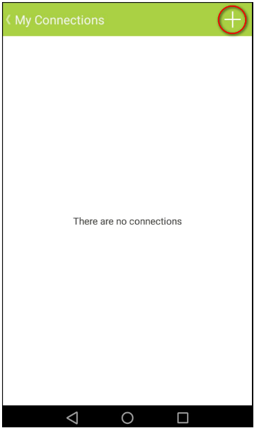

Figure 2 - Connections screen

1.  The "New connection" screen for connection registration will be displayed.;

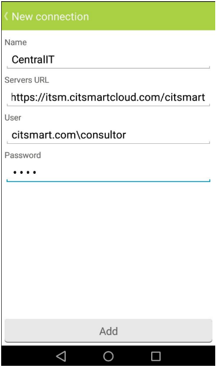

Figure 3 - Connection log screen

1.  Enter the relevant data:

    -   **Connection name**: Enter the name of the connection you want to
        connect to;

    -   **Server URL**: Enter the server address for the connection. The
        protocol (http) must be placed in the URL;

    -   **User**: enter the username;

    -   **Password**: enter the access password.

!!! Abstract "ATTENTION"

    If the device is changed, this connection must be deleted.  

1.  After entering the desired connection data, press the Add button;

2.  After the connection is added, the list of created connections will appear.
    To change a connection, simply select the desired connection and make the
    change;

3.  To connect, just select the connection, in the initial screen of the
    application;

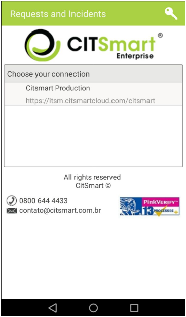

Figure 4 - CITSmart Enterprise (Android mobile from Play Store) login screen

Using the app on the mobile (smartphone)
----------------------------------------

##### Viewing service requests

After the connection is made, the "Service Requests" screen will be displayed
where you can view the requests according to the chosen filter and perform other
actions, which will be explained later.

1.  To choose the type of request you want to view, click the bar-shaped “Menu”
    icon located in the upper left corner;

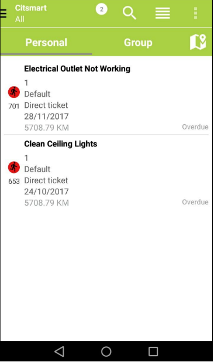

Figure 5 - Service requests screen

1.  A list with the types and quantities of requests of each type is presented,
    as shown in the figure below:

Figure 6 - Request types filter

1.  Select the type of request you want;

2.  After choosing the desired type, press the Personal option to view the
    personal requests or Group to view the workgroup requests according to the
    selected type;

3.  The list of service requests will be displayed, depending on the filter
    chosen:

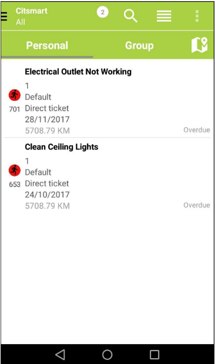

Figure 7 - Personal request list

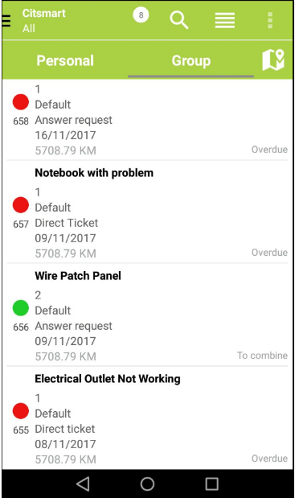

Figure 8 - Group request list

1.  To view specific requests, click the search “Search” icon. A field will be
    displayed to inform the desired request data (request number, contract name,
    unit name or executor group name). After entering the data, press "Enter".
    Once this is done, it will be redirected to the search screen, containing a
    list of requests resulting from the query performed, according to the
    example illustrated in the figure below:

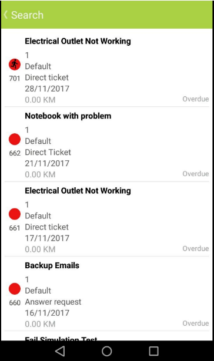

Figure 9 - List of requests

!!! Abstract "RULE"

    In order for the search functionality to work, it is necessary to
    configure the corresponding web service (notices) in the "Web Service
    Operation Register" screen in CITSmart Enterprise Web.  

1.  In each request a symbol with the color representing your situation is
    displayed, being:

    + Green (normal / in progress) - Indicates that the request is in service,
      within the established time;

    + Yellow (to win) - Indicates that the deadline for requesting the request is
      close to being exceeded;

    + Gray (suspended) - Indicates that the request has been suspended;

    + Red (expired) - Indicates that the deadline for requesting the request has
      been exceeded;

1.  To view the details of the service request, click on the desired request
    that will be displayed in the "Details" screen of the same. For follow-up
    requests, you can only view their description. In these, there are no
    buttons in the footer.

2.  When pulling down the screen, the existing requests will be updated, and new
    requests will be displayed;

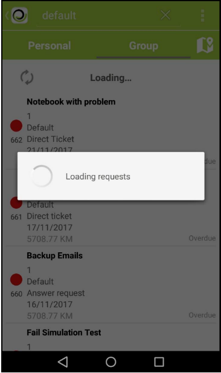

Figure 10 - Updating the list with new requests

1.  Pulling up on the screen will update existing requests and display old
    requests;

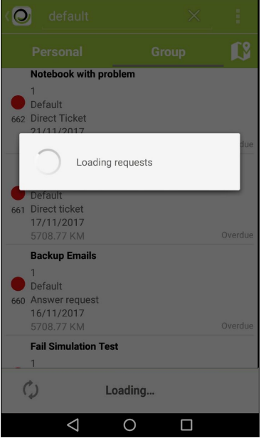

Figure 11 - Updating the list with old requests

1.  To sort the requests, click the sort “”Sort requests list” icon. You will be
    presented with a list of options for sorting (as shown in the figure below),
    select a desired option and click Ok;

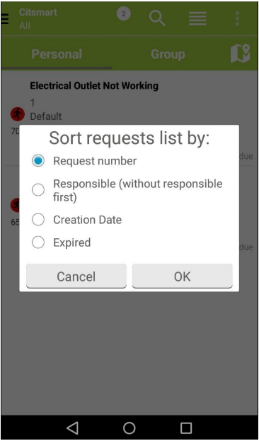

Figure 12 - Ordering of requests

   + **Request number:** Sorts the requests by the number, in descending order;

   + **Responsible (without first responsible):** Order the requests, first,
    without the current responsible. Then follows the ordering criteria by the
    request number, in descending order;

   + **Creation Date:** Sorts the requests, first, by the creation date, in
    ascending order. Then it follows the ordering criteria by the request
    number, in descending order;

   + **Expiration:** Orders the requests for applications due, close to maturity,
    on time and suspended. Then it follows the ordering criteria by the request
    number, in ascending order.

##### **Creating service request**

1.  To create a service request, press the icon located in the upper right
    corner of the screen and select the "New Incident / Request" option,
    depending on the screen resolution, the “New incident/request” icon , just
    press the same one to create the request, as illustrated below:

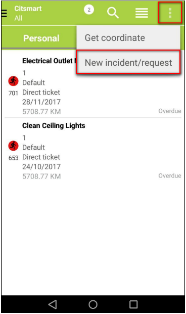

Figure 13 - Creating a service request

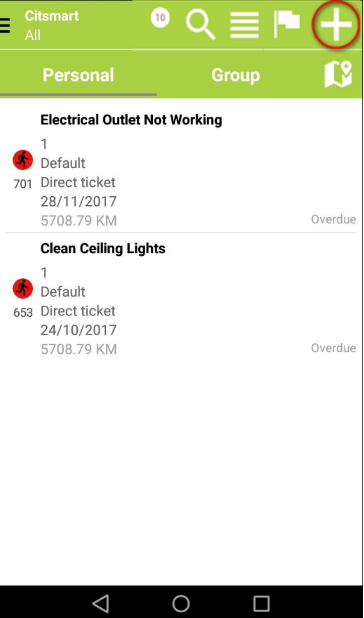

Figure 14 - Create service request icon

1.  The screen for creating the request will be displayed, as shown in the
    figure below:

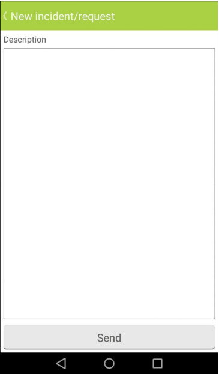

Figure 15 - New request creation screen

!!! Abstract "ATTENTION"

    The request registered by CITSmart Enterprise (Android mobile from Play
    Store) uses services that are configured in CITSmart Enterprise Web.  

1.  Enter the description of the service request and press the Send button to
    perform the operation;

2.  After performing the operation, the request registration message will be
    displayed.

Figure 16 - Created request

##### Approving/rejecting service request

Some requests need approval, so to meet them you need to approve them.

1.  Select the request that is eligible for approval;

2.  The "Details" screen will be displayed displaying the description of the
    request for approval/rejection of the request;

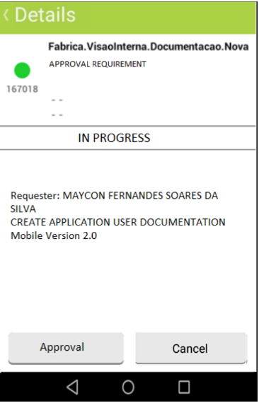

Figure 17 - Request approval/reject screen

1.  To approve the request, just press the Approve button;

2.  To reject the request, press the Reject button. A tea- la will be displayed
    to choose the justification for this rejection, as shown in the figure
    below:

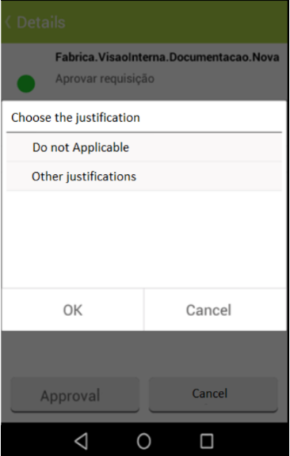

Figure 18 - Request rejection screen justified

  + Choose the justification for rejecting the request and press the "Ok" button.

Advanced use of mobile app (smartphone) - with maps
---------------------------------------------------

##### Updating the coordinates of a unit

Update the coordinates of a unit so that the system can identify the location of
the unit

1.  To view job requests on the map, press the Personal or Group option, and
    then press the “Map” icon . The map will be displayed showing the location
    of the requests;

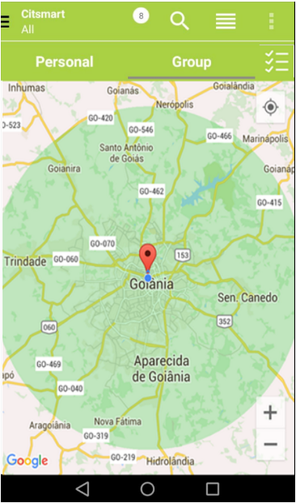

Figure 19 - Request on map

1.  To update the coordinates, press the icon located in the upper right corner
    of the screen and press the "Get Coordinates" option, depending on the
    screen resolution, the icon with the shape of a flag “Get coordinate”, just
    press it to update the coordinates;

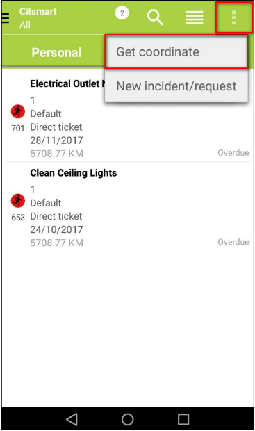

Figure 20 - Get coordinates

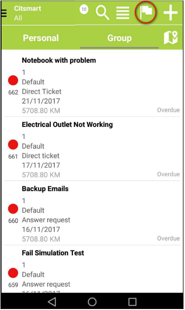

Figure 21 - Icon for get coordinates

1.  The "Get Coordinates" screen will appear:

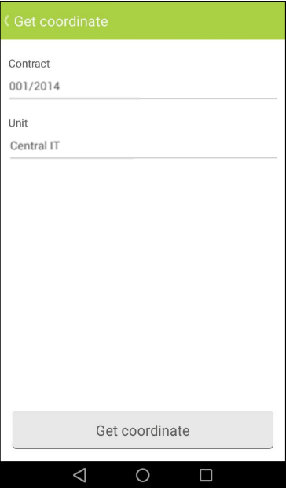

Figure 22 - Get coordinates screen

     + Select the contract and drive. Once this is done, press the Get Coordinates
       button to perform the operation;

     + Your latitude and longitude will be sent to the server (CITSmart Enterprise
       Web).

##### Serving service request

!!! Abstract "RULE"

    If you are in the list of group requests, and meet the request, it will
    become personal and will appear in the list of personal requests.  

1.  Stop answering a service request, select the desired request;

2.  If you are viewing the map requests and if you have only one registered
    service request, you can perform your request through the map, simply press
    the location point of the request and then select the request. If you have
    more than one service request, pressing the location location of the request
    will be directed to the personal or group request list.

Figure 26 - Request for service via map

1.  After selecting the request, the "Details" screen will be displayed,
    according to the example shown in the figure below:

Figure 27 - Answer service request

1.  Press the Answer button. You will be directed to the screen of the request,
    on-you will be able to check in;

Figure 28 - Service request

1.  To view the route from which to perform the service, simply press the View
    Route button;

    + A screen will appear to choose the route visualization application;

Figure 29 - Application to view the route

   + Selecione o aplicativo que irá utilizar para visualizar a rota;

   + Será exibida a tela de visualização da rota;

   + O caminho será mostrado a partir da sua localização até o local da
    solicitação.

!!! Abstract "RULE"

    In order to visualize the route, it is necessary that the unit has the
    coordinates configured from a longitude and latitude.  

1.  After checking the route and arriving at the place to meet the service
    request, check the request;

2.  To check in, press the icon located in the top bar of the screen;

    + The "Check-in" screen will be displayed;

Figure 30 - Check-in screen

    + Press the Check-in button to perform the operation;

!!! Abstract "RULE"

    When checking in, if the request is suspended, it will be reactivated and
    captured.  

1.  After checking in, the check-out screen will be displayed;

Figure 31 - Check-out screen

    + Enter request fulfillment status;

Figure 32 - Check-out - Service request status

    +   Select the status and press OK;

    + If you select the status "Suspended", a window will appear to record the
      reason for the suspension, as shown in the example shown in the figure
      below:

Figure 33 - Check-out - Reason request suspend registration

    + If you have selected the status "Solved", a window will be displayed to
    register the request termination, as shown in the example shown in the
    figure below:

Figure 34 - Check-out - Request closing record

##### Notifications

The CITSmart Enterprise Mobile application runs in the background on your phone,
so you automatically receive notifications that are actionable.

1.  Whenever you are close to the place of service of a service request, you
    will receive a notification, as shown in the illustration below:

Figure 35 - Notification of proximity to the request location

    + Select the notification, where you will see a screen asking if you want to
    check in, as shown in the illustration below:

Figure 36 - Request rejection justification screen

    + Please reply if you want to check in;

    + Pressing the Yes button will take you to the Check-in screen;

    + When you press the No button, you will be directed to the check-in negation
    screen, as shown in the figure below:

Figure 37 - Check denial screen

    + Please state the reason for denial of Request Check-In.

1.  When you are near the place of service of more than one service request, you
    will receive a notification containing the number of requests, according to
    the example shown in the figure below:

Figure 38 - Notification of proximity to the multiple requests service
location

    + When you select the notification, you will see a list of requests near your
    location, as shown in the figure below:

Figure 39 - Upcoming requests

1.  When a requestor delegates a service request, you will receive a
    notification, as shown in the figure below:

Figure 40 - Incoming request notification

   + Select the notification to be directed to your personal request list.

!!! tip "About"

    <b>Product/Version:</b> CITSmart ESP | 8.00 &nbsp;&nbsp;
    <b>Updated:</b>01/11/2019 - Anna Martins

