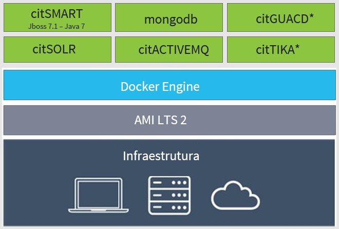

Title: Cloud

# CITSmart Cloud Plataform

##1. Route 53

It routes Internet traffic to the client server in the Citsmart Cloud, responds to DNS requests, and forwards them to the servers. It also performs Health Check detecting unavailability, monitors network and node integrity, and performs connection redirection automatically.
##2. VPC

Private network structure within the Citsmart Cloud. CITSmart's VPC does not have communication with other networks or VPC's except for the VPN established with the on-primes network.
##3. ELB (Elastic Load Balancer)

Elastic Load Balancer works over both HTTP and HTTPS traffic and provides advanced request routing at the individual request level (layer 7), and routes traffic to destinations within the Amazon Virtual Private Cloud (Amazon VPC) according to the content of the request. It is responsible for forwarding client requests to the Citsmart servers. In case of automatic escalation (auto-escalation), the ELB will detect the new service/server and add it as a member of the balancer.

##4. AMI (Amazon Machine Images)

AMI is an AWS machine image made to run an instance in the cloud. One instance is how virtual servers are called. Citsmart uses a custom AMI Linux image made by AWS that outperforms the Linux distributions on the market. Its Kernel is specifically customized to run on AWS infrastructure with superior performance. Currently Amazon Linux is in version 2, and is based on CentOS 7 version of Kernel 4.9. Further information at: https://aws.amazon.com/en/amazon-linux-2/
##5. RDS (Relational Database Service)

The Citsmart postgres relational database service. It performs automatic and "hot" synchronous replication of banks to another availability zone, integrates with Route 53 for automatic node switching in case of unavailability, automatic bank service failover, automatic snapshots and recovery of bank data.
##6. Network Operations Center

24x7 monitoring of Citsmart Cloud features and services. The analysts have the autonomy to detect the problems and take corrective actions in any sign of failure or degradation of services.
##7. NOC – Items monitored in Cloud*

CPU

Containers

ContextSwitch

Disco - IO

Discos

HTTP – Active Connections

ITSM - http

ITSM - https

Jvm - Bytes Loaded-Unloaded

Jvm - Class Bytes

Jvm - Classes Loaded-Unloaded

Jvm - Compilations
	

Jvm - Eden Space

Jvm - MaxHeapSize

Jvm - Old Generation

Jvm - Pending Objects

Jvm - Perm Generation

Jvm - Survivor 0

Jvm - Survivor 1

Jvm - Time Loading Classes

Jvm - Total of class

Jvm - Version

Load

Memory

Ping
	

Procs/s

RDS – Active Connections

RDS - Latency

SOLR

Swap - In/Out

Total of processes

* They also serve as a suggestion for monitoring on-premises deployments.

##8 – CITSmart Cloud 7 Overview - Docker

Today, all Citsmart running on an AMI image in the AWS cloud is running with Docker technology. The container images currently on the servers are:

 

citSMART: Software Citsmart together with Jboss 7.1 or Wildfly 12. It also have the Java 7 or Java 8 depending on the HSM version.

citSOLR: Apache SOLR Indexer

mongodb: Mongo non-relational database

citACTIVEMQ: Apache Active MQ

citGUACD: Part of the Apache Guacamole remote access suite.

citTIKA: Apache’s OCR Tika Software.

##ABOUT SECURITY ISSUES

Q – What level of security does CITSmart ® use for its cloud platform

A – CITSmart ® use AWS Cloud, so all security features that have there is applied for us. (read here) also we use AWS Database container with all necessary security criteria as well as automatic replication and attack protection mechanisms. We use Firewalls from AWS. The usage of CITSmart ® is able by HTTPS (encrypted session) to transmit information.

 

Q – How Backups are planned and made?

A – Data backup is automatically replicated in 2 availability zones (different regions). The Backup schedule is set by agreement with AWS.

 

Q – CITSmart ® is audit compliant?

A – He have an audit trail in CITSmart ®, this is one of Pink Verify certification requirements and for information monitoring and application usage, we use Dynatrace and it brings absolutely all the information needed to diagnose the application.
