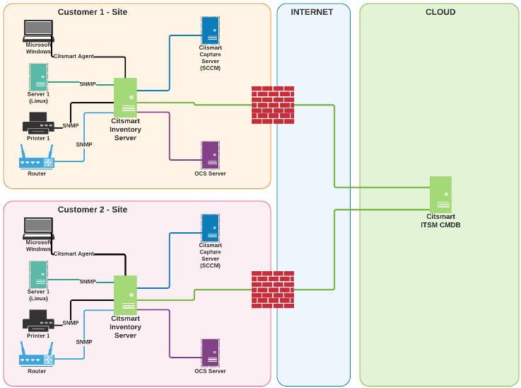
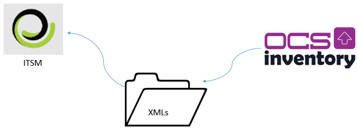

title: Configurar conexión Inventory
Description: Objetivo registrar todas las propiedades referentes a la conexión del CITSmart Inventory, de acuerdo con el IP y el puerto donde está instalado el Jboss del CITSmart Inventory.
#Configurar conexión Inventory

Esta funcionalidad tiene como objetivo registrar todas las propiedades
referentes a la conexión del CITSmart Inventory, de acuerdo con el IP y el
puerto donde está instalado el Jboss del CITSmart Inventory.

Antes de empezar
--------------------

La configuración de la funcionalidad requiere un servidor con aplicación de
inventario funcional y comunicable con el ITSM.

Procedimiento
-----------------

1. Acceder al menú principal Procesos \> Gestión de Evento \> Conexión \>
    Inventory;

2. En el area **Datods de la Conexión**, completar los campos;

3. Seleccionando el tipo de conexión, en el campo "Ignorar las máquinas ya
    inventadas" (en el caso de máquinas inventariadas, es posible definir
    cuántos días esa máquina quedará sin nuevo inventario y, por eso, su Status
    será colocado como Ignorado hasta que se pase el total de días
    parametrizado) se abrirán dos cuadros que se refieren a Período y Formato
    del período, marcar la opción que mejor encaje y guardar la configuración;

    

       Figura 1 -Integración CITSmart inventory

4. Si el tipo de conexión elegido es el *OCS Inventory*, se mostrará su campo de configuración para que se informe el repositorio XML, como se muestra a continuación. Además, hay algunos **requisitos previos** muy relevantes que se deben observar:

   
Figura 2 -Integración CITSmart inventory - OCS inventory

+   Después de instalar el OCS Inventory, no viene como estándar cualquier tipo de integración con otro sistema, para ello, en el           menú Inventory files, debe asignar GENERATE_OCS_FILES = ON, OCS_FILES_FORMAT = XML y especificar la ruta donde se guardarán los         archivos XML en OCS_FILES_PATH

    +   La ubicación especificada para la generación de archivos XML es algo muy
        estratégico:

       +   Si el servidor OCS es el mismo servidor del Inventory, se trata del
           menor riesgo, ya que la carpeta probablemente será accesible para la
           lectura;

       +   Si el servidor OCS **NO** es el mismo servidor del Inventory, se debe
           optar por una de estas dos opciones:

           +   el OCS Inventory debe tener permiso para escribir en el servidor del
               Inventory;

           +   el inventario debe tener permiso (compartir) en el servidor OCS
               Inventory.

5. La aplicación de inventario realiza la captura de los datos a través del puerto del agente SNMP (161) y/o del agente de captura (puerto 7103 desarrollado por CITSmart Corporation, en .Net). Inicialmente, Inventory realiza un comando "ping" para comprobar si la máquina está activa. Si consigue realizar el comando, intenta acceder al puerto SNMP del elemento de configuración. Si el acceso al puerto no se obtiene con éxito, Inventory intenta realizar el acceso a través del agente de captura haciendo clic en el botón "Probar Conexión";

6. Hacer clic en "Guardar y Aplicar Configuraciones".

Relacionado
-------

[Registrar gerente Inventory](/es-es/citsmart-esp-8/processes/event/configuration/register-inventory-manager.html)

!!! tip "About"

    <b>Product/Version:</b> CITSmart ESP | 8.00 &nbsp;&nbsp;
    <b>Updated:</b>01/24/2019 - Anna Martins
