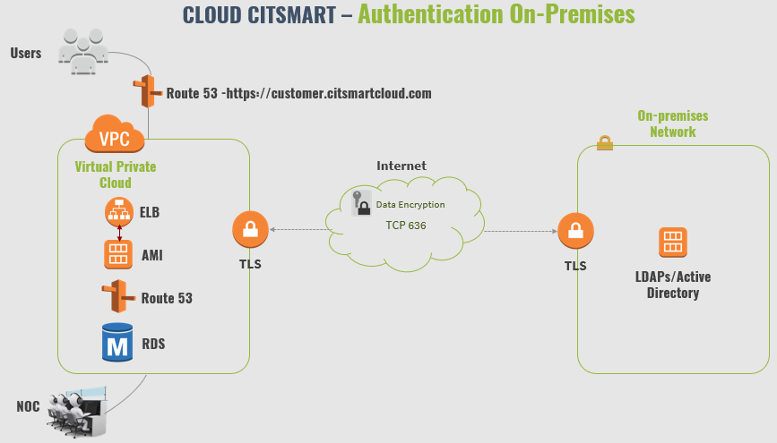

title:  Registrara conexiones LDAP
Description: Permite administrar los directorios, es decir, acceder a bases de datos de usuarios en una red a través de protocolos TCP/IP.

# Registrara conexiones LDAP

El LDAP (Lightweight Directory Access Protocol - Protocolo Ligero/Simplificado de Acceso a Directorios) es un protocolo estándar que permite administrar directorios, es decir, acceder a bancos de información sobre los usuarios de una red a través de protocolos TCP/IP.

Se puede configurar CITSmart para consultar las bases de usuarios disponibles en un servicio de directorio (Microsoft Active Directory o LDAP abierto), permitiendo así que estos usuarios se autentiquen en CITSmart usando sus credenciales sin tener que inscribirlos manualmente (en CITSmart).

Actualmente, la lectura de datos de un servidor AD/LDAP se reduce al objeto "usuario". De esa manera, se puede usar filtros para llevarlos a CITSmart. Además, se puede usar la opción "Mapeo de campos" para cargar información de atributos (por ejemplo: correo electrónico, teléfono, ubicación y más).

A continuación se muestra un modelo de autenticación para clientes de CITSmart Cloud que desean utilizar su base de directorio local (on-premises).

## Antes de empezar

Si desea configurar la sincronización automática de usuarios, se debe crear un CRON para este propósito (por ejemplo: sincronizar usuarios todos los días a las 00:00). Para crear un horario, vaya al menú Procesos > Gestión de eventos > Horario.

## Procedimiento

### Configurar conexión

1.  Acceder al menú ParaAcessar o menu Parametrización > Configuración LDAP;
2.  Hacer clic en "Nuevo";
3.  Completar los campos disponibles;

    | Campo | Descripción | Ejemplo |
    |-----|---------|-------|
    | Implementación | Tipo do servidor del directorio | AD/OpenLDAP |
    | URL Conexión | Dirección de acceso a la base del directorio. Tenga en cuenta que se puede usar una conexión no cifrada (puerto 389) o cifrada (puerto 636) | ldaps://auth.domain.com:636 |
    | DN Base | DN Base utilizado para buscar entradas de usuarios|dc=domain,dc=com |
    | DN Alias | Dominio/Nombre de la conexión, este nombre será visible en la pantalla de inicio de sesión|domain.com |
    | Filtro | Filtrar para consultar objetos en directorios | (&(objectCategory=person)(objectClass=user)) |
    | DN Manager | Usuario autorizado a buscar el directorio. En este caso, ingrese el valor de acuerdo con el atributo "distinguishedName" del AD | CN=Service User,OU=COMPANY,DC=domain,DC=com |
    | Pwd Manager|La contraseña del DN Manager | ***** |
    | Configuración predeterminada | Si la conexión está disponible en la pantalla de inicio de sesión | Sí/No |

    !!! info "IMPORTANTE"
        Si no existen Grupos DN, complete el campo "DN Grupo" solo con un asterisco. Esto hará que el sistema verifique todo el dominio.

4. Verificar la conectividad con la base, para eso, hacer clic en "Probar conexión", si todos los datos son correctos, recibirá el mensaje "La conexión fue exitosa";
5. Hacer clic en "Grabar".

    !!! warning "ATENCIÓN"

        Antes de solicitar la prueba **se debe** hacer clic en el botón "Grabar" para guardar la configuración; de lo contrario, la prueba utilizará los datos antes de los cambios realizados en la pantalla.

### Configurar Grupo DN y Apuntamientos

Después de configurar con éxito una conexión, debe agregar preferencias para la sincronización de usuarios, en cuyo caso debe ingresar Grupos LDAP y Mapeo de campos. Para los "Grupos LDAP", tiene la capacidad de crear personalizaciones donde ciertos usuarios heredarán automáticamente los permisos en CITSmart a través del enlace con el Perfil de Acceso o Grupo. Para el elemento "Mapeo de campos", se puede configurar la aplicación para que lea la información del atributo AD/LDAP y la incorpore al registro del empleado (por ejemplo: leer el atributo "mail" y alimente el campo "e-mail" del empleado).

1.  Para vincular nuevos grupos, hacer clic en "Agregar" en el área **Grupos LDAP** e ingresar los datos:

    | Campo | Descripción | Ejemplo |
    |-------|-----------|---------|
    | DN Grupo | Camino al Grupo DN | OU=Users,OU=Company |
    | Filtro | Filtro para búsqueda de objetos. Dejar en blanco para usar lo definido en la conexión | (&(objectCategory=person)(objectClass=user)) |
    | Atributo para nombre | Informar el atributo para la lectura del nombre (ex.: CN, SamAccountName etc.)  | CN |
    | Actualizar vínculos | La frecuencia que se actualizarán los datos en función del servidor AD/LDAP (Opciones: Siempre, Nunca o Sólo en la creación) | Siempre |
    | Perfil de acceso | Perfil del sistema que los usuarios van heredar | Administrador |
    | Grupo | Se ingresarán los usuarios del grupo del sistema | Gerentes |
    | Programador | Período en que se ejecutará la sincronización automática | [Todos los dias]* |

2.  Para vincular atributos a los campos, haga clic en "Agregar" en el área **Mapeo de campos**, ingrese el nombre del campo LDAP y seleccione el campo correspondiente en CITSmart;

    | Campo no LDAP | Campo en el sistema |
    |-------|-----------|
    | mail | E-mail |
    | telephoneNumber | Telefono |
    | localeID | Localidad |

3.  Hacer clic en "Grabar".

    !!! note "NOTA"

        Cuando hay una solicitud de autenticación en la pantalla de identificación del sistema
        (inicio de sesión y contraseña), se ejecuta un ciclo de búsqueda de conexión correcto basado
        en esta configuración, es decir, hay un intento de autenticación para cada dominio
        registrado aquí (si hay más de uno).

### Para usar el protocolo LDAP

El uso del protocolo LDAP en CITSmart requiere el certificado público del servidor AD/LDAP en el almacén de certificados CA del JAVA (en su servidor Wildfly). Por lo tanto, debe exportarlo desde el servidor AD/LDAP e importarlo a su instancia. Si tiene preguntas sobre la importación de certificados en el servidor de aplicaciones, consulte el [documento de instalación][1].

## Lo que hacer después

Para usar la autenticación AD/LDAP de manera efectiva, después de registrar la conexión, cambie el parámetro 22 e ingrese un valor igual a "2", es decir, indique que el método de autenticación predeterminado en CITSmart es AD/LDAP. Sin embargo, la autenticación manual continuará funcionando normalmente.

## Relacionado

[Registrar horario][2]

[1]:/es-es/citsmart-platform-8/get-started/installation-and-upgrade/perform-installation.html
[2]:/es-es/citsmart-platform-8/processes/event/configuration/register-time.html
