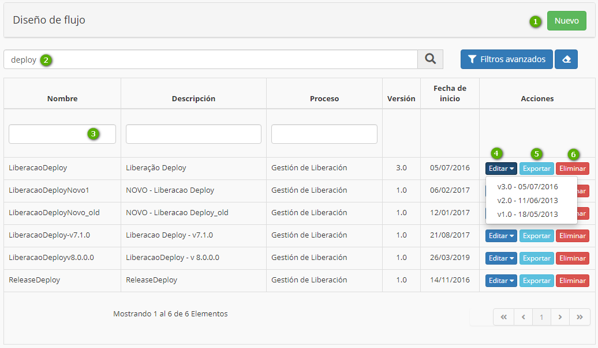
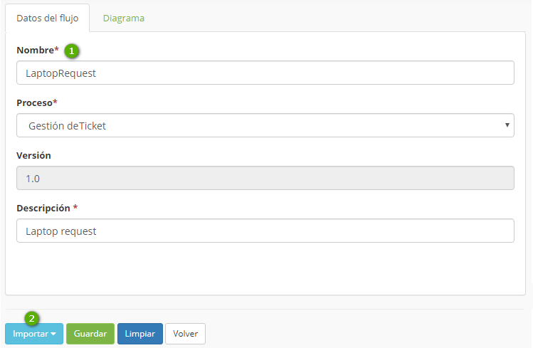
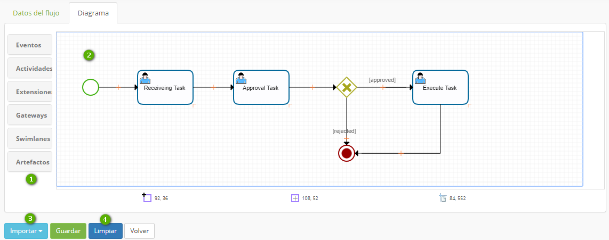

Title: Visión General

# Visión General

## Presentación

Workflows son representaciones visuales de algo que se mueve continuamente. La funcionalidad de Workflow tiene el propósito de modelar sus objetivos de negocio, describiendo los pasos que necesitan ser ejecutados para alcanzar esos objetivos a través de un workflow digital inteligente. Es posible crear workflows para ayudar en la gestión de servicios, problemas, cambios, liberaciones, acciones de continuidad, solicitudes de viajes y compras. Siendo así, el workflow posee interacción con los principales procesos del CITSmart.

## Funcionalidades

**Estándar:**

- [Diseño de Flujo][1]

- [Expresiones][2]

- [Modelado de proceso][3]

**Integración Neuro:**

- [Flujo de integración][4]

- [Regla de negocio][5]

- Proceso de Negocio

!!! info "ALERTA"
    
    Estos elementos sólo estarán disponibles cuando la aplicación [Neuro está habilitada][7] en su instancia.

## Interfaz

### Pantalla principal

Figura 1 - Pantalla principal

 - **1**: Nuevo - hacer clic para diseñar el workflow

 - **2**: Campo de búsqueda - busca workflows por su nombre o por parte del nombre
 
 - **3**: Filtros - al seleccionar el botón "Filtros avanzados", estos campos estarán disponibles para la búsqueda
 
 - **4**: Editar - hacer clic para editar un workflow ya existente, pudiendo elegir qué versión será editada
 
 - **5**: Exportar - generar documento en formato JSON
 
 - **6**: Borrar - hacer clic para borrar un workflow

### Pestaña de Datos del Workflow

Al hacer clic en "Nuevo" en la pantalla principal, la pantalla de registro de workflow estará disponible en la pestaña inicial de Datos del Workflow.

Figura 2 - Datos del workflow

 - **1**: Datos básicos para registrar un workflow
  
 - **2**: Importar: es posible importar un workflow ya existente, en los formatos JSON y XML

### Pestaña Diagrama

Figura 3 - Diagrama

- **1** : Elementos para diseño del workflow:
  
  **Eventos**: son los elementos de eventos que se pueden utilizar en el diseño del workflow:

  • Evento Inicio

  • Evento Intermedio de Envío de Link

  • Evento Intermedio de Captura de Link

  • Evento Intermedio de Temporizador

  • Boundary - Evento Intermedio de Captura de Error

  • Evento Intermedio de Captura de Señal

  • Evento de Finalización con Error

  • Evento de Fin
  
  **Actividades**: son los elementos de actividades que pueden ser utilizados en el diseño del workflow:

   • Tarea de Usuario

   • Tarea Script

   • Envío de Mensajes – E-mail

   • Tarea de Regla de Negocio

   • Tarea de Servicio – ESI

   • Almacenamiento de Datos

   • Subproceso
   
   **Extensiones**: son las extensiones que se pueden utilizar en el diseño del workflow:

   • Comunicación REST

   • Notificación

   • Asignación de Variables

   • Conversación Watson
   
   **Gateways**: son los elementos de gateway que se pueden utilizar en el diseño del workflow:

   • Gateway Inclusivo

   • Gateway Paralelo

   • Gateway Exclusivo

   • Gateway Complejo

   • Gateway Basado en Evento
   
   **Swimianes**: son los elementos de swimianes que se pueden utilizar en el diseño del workflow:

   • Pool/Participante

   • Lane
   
   **Artefacto**: es el elemento de artefacto que se puede utilizar en el diseño del workflow:

   • Anotaciones de Texto
   

 - **2**: Campo de modelado – espacio para el diseño del workflow
 
 - **3**: Importar - es posible importar un workflow ya existente, en los formatos JSON y XML

 - **4**: Limpiar – limpia el diseño del workflow elaborado

### Pestaña Documentación

 - Visualización del diseño generado en la pestaña Diagrama

 - Descripción de los elementos utilizados en el workflow generado

 - Visualización de documentos vinculados al workflow

### Botones

Figura 4 - Botones pestaña Documentación

 - **1**: Guardar:  
 
     •	Como nueva versión: guarda el diseño del workflow como una nueva versión

     •	En la versión original: guarda el diseño del workflow en la versión original, es decir, la 1.0 - versión en diseño

 - **2**: Generar Documentación: permite la exportación de la información del workflow en formato PDF

Uso
---

[Crear workflow](/es-es/citsmart-platform-8/workflow/use/create-flow.html)

[Modelado de proceso](/es-es/citsmart-platform-8/workflow/use/modeling.html)

[Configurar actividad de usuario en el workflow](/es-es/citsmart-platform-8/workflow/use/user-task-configure.html)

Configuración
----------

[Construir expresiones](/es-es/citsmart-platform-8/workflow/configuration/expressions-creator.html)

!!! tip "About"

    <b>Product/Version:</b> CITSmart Platform | 8.00 &nbsp;&nbsp;
    <b>Updated:</b>04/12/2019 - Anna Martins

[1]:/es-es/citsmart-platform-8/workflow/use/create-flow.html
[2]:/es-es/citsmart-platform-8/workflow/configuration/expressions-creator.html
[3]:/es-es/citsmart-platform-8/workflow/use/modeling.html
[4]:/es-es/neuro/advanced-options/process-integration-flow.html
[5]:/es-es/neuro/advanced-options/business-rules.html
[6]:
[7]:/es-es/neuro/enable-neuro.html
