title: Manual do usuário do aplicativo mobile CITSmart Enterprise ITSM (Android)
Description: Fornecer orientações necessárias para instalar, configurar e utilizar o aplicativo CITSmart Enterprise Mobile.
#Manual do usuário do aplicativo mobile CITSmart Enterprise ITSM (Android)

Este documento tem o propósito de fornecer orientações necessárias para
instalar, configurar e utilizar o aplicativo CITSmart Enterprise Mobile.

O CITSmart Enterprise Mobile oferece vários recursos, sendo:

1.  Facilidade no atendimento e ter um direcionamento de onde a solicitação está
    localizada;

2.  Filtrar solicitações pessoais e por grupo de trabalho;

3.  Visualização dos detalhes de uma solicitação de serviço;

4.  Visualização de solicitações em mapa;

5.  Visualização da melhor rota para chegar ao local de atendimento da
    solicitação de serviço;

6.  Atualização da localização da unidade latitude longitude a partir do
    aparelho mobile;

7.  Realização de check-out caso o usuário tenha permissão de execução;

8.  Negação de um check-in sugerido pelo sistema;

9.  Recebimento de notificações.

Este documento foi estruturado em quatro grandes seções:

1.  Antes de começar;

2.  Instalação e Configuração do App no Celular (Smartphone);

3.  Utilização do App no Celular (Smartphone);

4.  Utilização *Avançada* do App no Celular (Smartphone) - com Mapas.

Antes de começar
----------------

1.  É necessário Implantar a versão 7.2.2.0 (ou superior) do CITSmart
    Enterprise Mobile e também Configurar o servidor para uso do aplicativo
    mobile CITSmart Enterprise Mobile (ver Relacionados).

Instalação e configuração do app no celular (smartphone)
---------------------------------------------------------

Para instalar o CITSmart Enterprise Mobile, deve ser realizada a busca do
aplicativo na loja on-line (Google Play).

1.  Pesquise por CITSmart Enterprise e após a pesquisa, selecione o aplicativo;

2.  Pressione o botão "Instalar" para baixar o aplicativo;

3.  Após a instalação aparecerá em seus aplicativos o ícone do CITSmart
    Enterprise Mobile;

4.  Para criar uma conexão, pressione o ícone com formato de chave, localizado
    no canto direito superior da tela;

    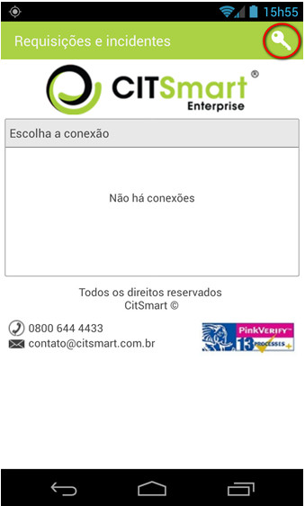

    Figura 1 - Criar conexão

5.  Será apresentada a tela de conexões, pressione o ícone "Nova conexão" , localizado no
    canto direito superior da tela, conforme indicado na figura abaixo:

    

    Figura 2 - Tela de conexões

6.  Será apresentada a tela “Nova conexão” para registro da conexão;

    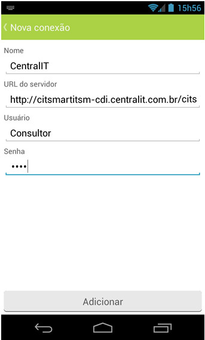

    Figura 3 - Registro de conexão

7.  Informe os dados:

       +  **Nome**: informe o nome da conexão que deseja conectar;

       +  **URL do servidor**: informe o endereço do servidor para conexão. Deve
        ser colocado o protocolo (http) na URL;

       +  **Usuário**: informe o nome de usuário;

       +  **Senha**: informe a senha de acesso.

    !!! Abstract "ATENÇÃO"

        Caso o aparelho seja trocado, esta conexão deve ser deletada.  

8.  Após informar os dados da conexão desejada, pressione no botão *Adicionar*;

9.  Depois de adicionada a conexão, aparecerá a listagem das conexões criadas.
    Para alterar uma conexão, basta selecionar a conexão desejada e fazer a
    alteração;

10.  Para se conectar, basta selecionar a conexão, na tela inicial do aplicativo;

    

    Figura 4 - Login

Utilização do app no cellular (smartphone)
------------------------------------------

##### Visualizando solicitações de serviço

Após realizar a conexão, será apresentada a tela de “Solicitações de Serviço”
onde poderá visualizar as solicitações de acordo com o filtro escolhido e
realizar demais ações, que serão explicadas adiante.

1.  Para escolher o tipo de solicitação que deseja visualizar, clique no ícone
    com formato de barras localizado no canto esquerdo superior;

    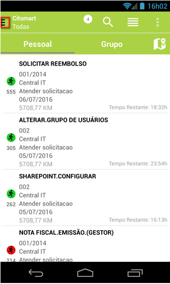

    Figura 5 - Solicitações de serviço

2.  É apresentado uma lista com os tipos e as quantidades de solicitações de
    cada tipo, conforme apresentada na figura abaixo:

    

    Figura 6 - Filtros

3.  Selecione o tipo de solicitação desejado;

4.  Após escolher o tipo desejado, pressione a opção Pessoal para visualizar as
    solicitações pessoais ou Grupo para visualizar as solicitações do grupo de
    trabalho de acordo com o tipo selecionado;

5.  Será apresentada a lista de solicitações de serviço, conforme o filtro
    escolhido:

    

    Figura 7 - Lista de solicitação pessoal

    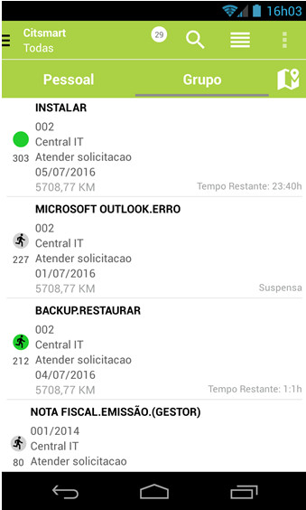

    Figura 8 - Lista de solicitação do grupo

6.  Para visualizar solicitações específicas, clique no ícone de pesquisa.
    Será apresentada um campo para informar o dado da solicitação desejada
    (número da solicitação, nome do contrato, nome da unidade ou nome do grupo
    executor). Após informação do dado, pressione “Enter”. Feito isso, será
    redirecionado para a tela de busca, contendo uma lista de solicitações
    resultantes da consulta realizada, conforme exemplo ilustrado na figura
    baixo:

    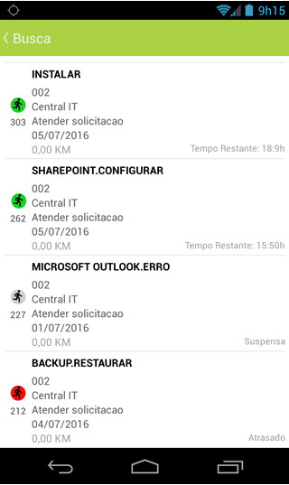

    Figura 9 - Lista de solicitações

    !!! Abstract "REGRA"

        Para que a funcionalidade de busca funcione, é necessário configurar o web
        service (notification_buscaNotificacao) correspondente na tela de “Cadastro
        de Operação Web Service” no CITSmart Enterprise Web.  

7.  Em cada solicitação é apresentado um símbolo com a cor que representa sua
    situação, sendo:

       +  Verde (normal/em andamento): indica que a solicitação está em
          atendimento, dentro do prazo estabelecido;

       +  Amarelo (a vencer): indica que o prazo limite para atendimento da
          solicitação está perto de ser ultrapassado;

       +  Cinza (suspensa): indica que a solicitação foi suspensa;

       +  Vermelho (vencida): indica que o prazo limite para atendimento da
          solicitação foi ultrapassado.

8.  Para visualizar os detalhes da solicitação de serviço, clique na solicitação
    desejada que será apresenta a tela de “Detalhes” da mesma. Para as
    solicitações que são de acompanhamento, apenas é possível visualizar a sua
    descrição. Nestas, não existem botões no rodapé;

9.  Ao realizar o pull down na tela, serão atualizadas as solicitações
    existentes e exibidas novas solicitações;

    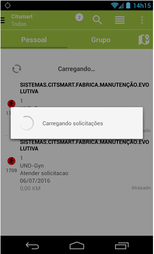

    Figura 10 - Atualização da lista com novas solicitações

10.  Ao realizar o pull up na tela, serão atualizadas as solicitações existentes
    e exibidas as solicitações antigas;

    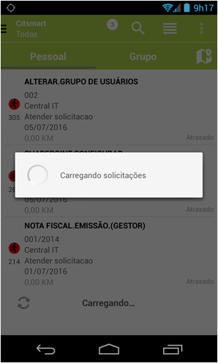

    Figura 11 - Atualização da lista com solicitações antigas

11.  Para ordenar as solicitações, clique no ícone de "Ordenar lista de solicitações". Será exibida
    uma lista de opções para ordenação (conforme ilustrada na figura abaixo),
    selecione uma opção desejada e clique em "Ok";

    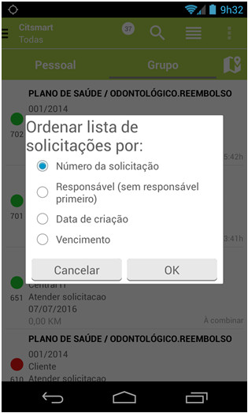

    Figura 12 - Ordenação de solicitações

       +  **Número da solicitação**: ordena as solicitações pelo número, em ordem
            decrescente;

       +  **Responsável (sem responsável primeiro)**: ordena as solicitações,
            primeiramente, sem o responsável atual. Depois segue o critério de ordenação
            pelo número da solicitação, em ordem decrescente;

       +  **Data de criação**: ordena as solicitações, primeiramente, pela data de
            criação, em ordem crescente. Depois segue o critério de ordenação pelo
            número da solicitação, em ordem decrescente;

       +  **Vencimento**: ordena as solicitações por solicitações vencidas, próximas
            do vencimento, dentro do prazo e suspensas. Depois segue o critério de
            ordenação pelo número da solicitação, em ordem decrescente.

##### Criando solicitação de serviço

1.  Para criar uma solicitação de serviço, pressione o ícone localizado no
    canto direito superior da tela e selecione a opção “Novo
    incidente/requisição”, dependendo da resolução da tela, será exibido o ícone
    com formato de sinal de mais , basta pressionar o mesmo para criação da
    solicitação, conforme ilustrado abaixo:

    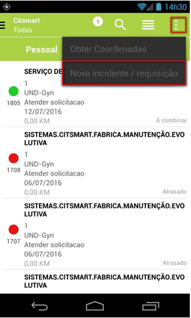

    Figura 13 -Criação de solicitação de serviço

    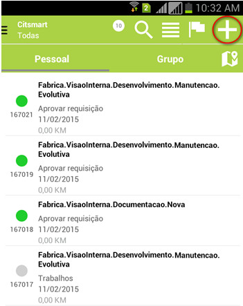

    Figura 14 - Ícone para criar solicitação de serviço

2.  Será exibida a tela para criação da solicitação, conforme apresentada na
    figura abaixo:

    

    Figura 15 -Tela de criação de nova solicitação

    !!! Abstract "ATENÇÃO"

        A solicitação registrada pelo CITSmart Enterprise Mobile utiliza serviços
        que são configurados no CITSmart Enterprise Web.  

3.  Informe a descrição da solicitação de serviço e pressione o
    botão "Enviar" para efetuar a operação;

4.  Após efetuar a operação, a mensagem de registro da solicitação será
    apresentada.

    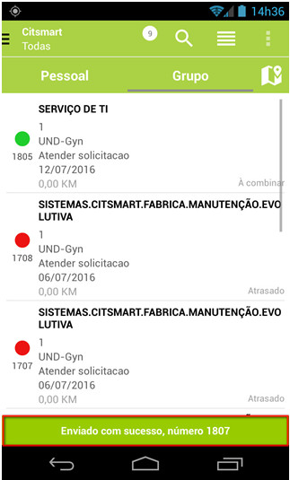

    Figura 16 - Solicitação criada

##### Aprovando/rejeitando solicitação de serviço

Algumas solicitações necessitam de aprovação, portanto, para atendê-las é
necessário aprová-las.

1.  Selecione a solicitação que é passível de aprovação;

2.  Será apresentada a tela de “Detalhes” exibindo a descrição da solicitação
    para aprovação/rejeição da mesma;

    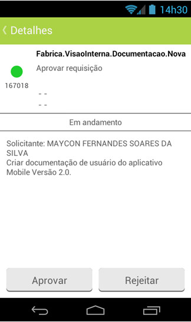

    Figura 17 - Tela de aprovação/rejeição de solicitação

3.  Para aprovar a solicitação, basta pressionar o botão "Aprovar";

4.  Para rejeitar a solicitação, pressione o botão "Rejeitar". Será exibida uma
    tela para escolha da justificativa desta rejeição, conforme apresentada na
    figura abaixo:

    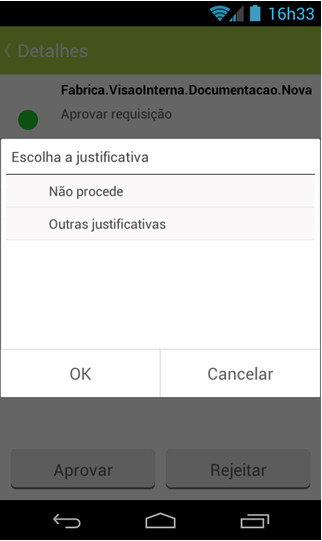

    Figura 18 - Tela justificava de rejeição da solicitação

       +  Escolha a justificava da rejeição da solicitação e pressione o botão "Ok".

Utilização avançada da aplicação no celular (smartphone) – com mapas
-----------

##### Atualizando as coordenadas de uma unidade

Atualize as coordenadas de uma unidade para que o sistema possa identificar a
localização da mesma.

1.  Para visualizar as solicitações de trabalho pelo mapa, pressione a opção
    Pessoal ou Grupo e logo em seguida pressione o ícone "Obter coordenadas". Será apresentado o
    mapa exibindo a localização das solicitações;

    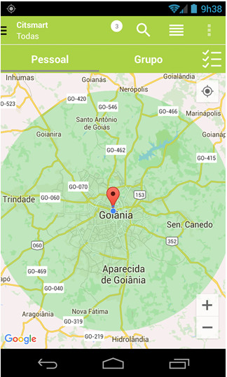

    Figura 19 - Solicitação em mapa

2.  Para atualizar as coordenadas, pressione o ícone localizado no canto
    direito superior da tela e pressione a opção “Obter Coordenadas”, dependendo
    da resolução da tela, será exibido o ícone com formato de uma bandeira,
    basta pressionar o mesmo para atualização das coordenadas;

    

    Figura 20 - Obter coordenadas

    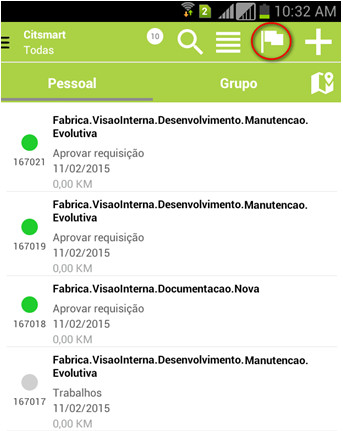

    Figura 21 - Ícone para obter coordenadas

3.  Será apresentada a tela “Obter Coordenadas”:

    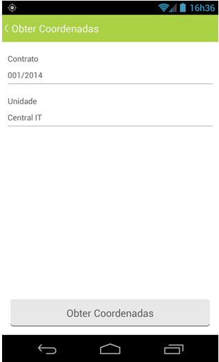

    Figura 22 -Tela de obter coordenadas

       -   Selecione o contrato e a unidade. Feito isso, pressione o botão "Obter
           Coordenadas" para efetuar a operação;

       -   Será enviado sua latitude e longitude ao servidor (CITSmart Enterprise Web).

##### Atendendo solicitação de serviço

   !!! Abstract "REGRA"

       Se estiver na lista de solicitações de grupo, e atender à solicitação, a
       mesma passará a ser pessoal, sendo exibida na lista de solicitações pessoais

1.  Parar atender uma solicitação de serviço, selecione a solicitação desejada;

2.  Se estiver visualizando as solicitações via mapa e caso tenha somente uma
    solicitação de serviço registrada é possível realizar o seu atendimento
    através do mapa, basta pressionar o ponto de localização da solicitação e
    logo em seguinte selecionar a solicitação. Caso tenha mais de uma
    solicitação de serviço, ao pressionar o ponto de localização da solicitação,
    será direcionado para lista de solicitação pessoal ou do grupo.

    

     Figura 23 - Atendimento de solicitação via mapa

3.  Após selecionar a solicitação, será apresentada a tela de “Detalhes” da
    mesma, conforme o exemplo apresentado na figura abaixo:

    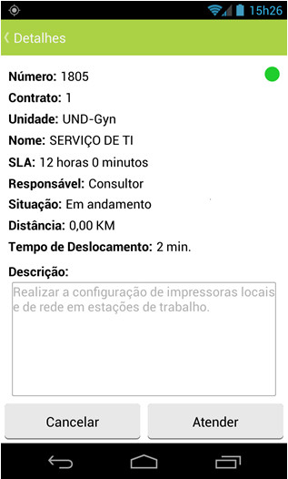

    Figura 24 - Atender solicitação de serviço

4.  Pressione o botão "Atender". Será direcionada para tela da solicitação, onde
    será possível realizar o check-in;

    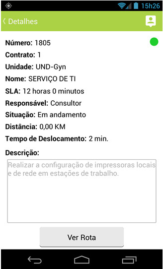

    Figura 25 -Solicitação de serviço

5.  Para visualizar a rota de onde realizará o atendimento, basta pressionar o
    botão "Ver Rota";

       +  Será exibida uma tela para escolher o aplicativo de visualização da rota;

    

    Figura 26 - Aplicativo para visualizar a rota

       +  Selecione o aplicativo que irá utilizar para visualizar a rota;

       +  Será exibida a tela de visualização da rota;

       +  O caminho será mostrado a partir da sua localização até o local da
          solicitação.

    !!! Abstract "REGRA"

        Para que seja possível visualizar a rota, é necessário que a unidade tenha
        as coordenadas configuradas a partir de uma longitude e latitude.  

6.  Após verificar a rota e chegar no local para atendimento da solicitação de
    serviço, realize o check-in da solicitação;

7.  Para realizar o check-in, pressione o ícone localizado na barra superior da
    tela;

       +  Será exibida a tela de “Check-in”, conforme exemplo apresentado na figura
          abaixo:

    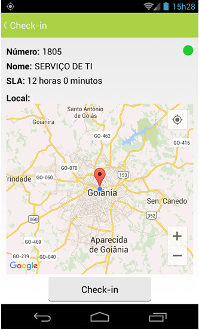

    Figura 27 - Tela de check-in

       -  Pressione o botão "Check-in" para efetuar a operação;

    !!! Abstract "REGRA"

        Ao realizar o check-in, caso a solicitação esteja suspensa, a mesma será
        reativada e capturada.

8.  Após realizar o check-in será exibida a tela para realizar o check-out;

    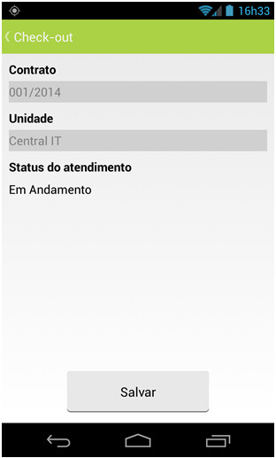

    Figura 28 - Tela de check-out

       +  Informe o status do atendimento da solicitação;

    

    Figura 29 - Check-out - Status da solicitação de serviço

       +   Selecione o status e pressione "OK";

       +   Caso tenha selecione o status “Suspensa”, será exibida uma janela para
           registrar o motivo da suspensão, conforme apresentada no exemplo ilustrado
           na figura abaixo:

    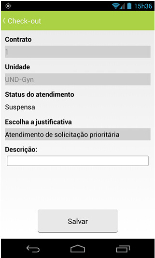

    Figura 30 -  Check-out - Registro do motivo da suspensão da solicitação

       +   Caso tenha selecionado o status “Resolvida”, será exibida uma janela para
           registrar o encerramento da solicitação, conforme apresentada no exemplo
           ilustrado na figura abaixo:

    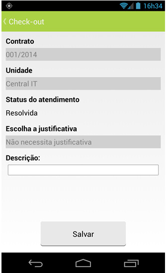

    Figura 31 -  Check-out - Registro de encerramento da solicitação

##### Notificações

O aplicativo CITSmart Enterprise Mobile fica rodando em background no celular,
através disso, você recebe automaticamente notificações que são passiveis de
ação.

1.  Sempre que você estiver próximo ao local de atendimento de uma solicitação
    de serviço, receberá uma notificação, conforme o exemplo ilustrado na figura
    abaixo:

    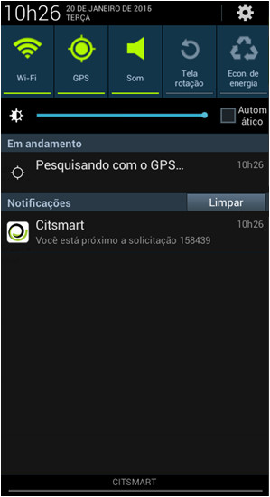

     Figura 32 - Notificação de proximidade do local de atendimento da
     solicitação

       +   Selecione a notificação, onde será exibida uma tela questionando se deseja
           realizar o Check-in, conforme exemplo ilustrado na figura abaixo:

     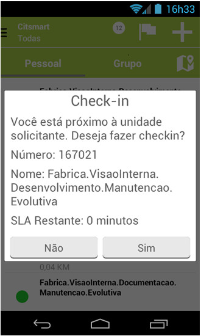

     Figura 33 - Tela de justificava de rejeição da solicitação

       +  Responda se deseja realizar o Check-in;

       +  Ao pressionar o botão "Sim", será direcionado para tela de Check-in;

       +  Ao pressionar o botão "Não", será direcionada para tela de registro da
          negação do Check-in, conforme o exemplo ilustrado na figura abaixo:

    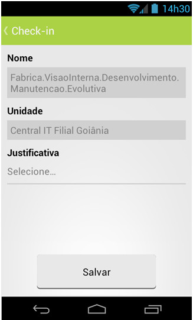

    Figura 34 - Tela de negação do check-in

       +  Informe o motivo da negação do Check-in da solicitação.

2.  Quando estiver próximo ao local de atendimento de mais de uma solicitação de
    serviço, receberá uma notificação contendo a quantidade de solicitações,
    conforme o exemplo ilustrado na figura abaixo:

    

    Figura 35 - Notificação de proximidade do local de atendimento de várias
    solicitações

       +  Ao selecionar a notificação, será exibida uma lista de solicitações próximas
          de sua localização, conforme exemplo ilustrado na figura abaixo:

    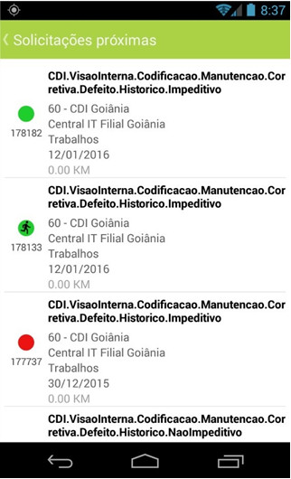

    Figura 36 -Solicitações próximas

3.  Quando um solicitante delegar uma solicitação de serviço, receberá uma
    notificação, conforme o exemplo ilustrado na figura abaixo:

    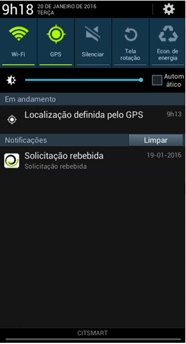

    Figura 37 -Notificação de solicitação recebida

       +  Selecione a notificação para ser direcionado à sua lista de solicitação
          pessoal.

Relacionado
-----------
[Manual de configuração do servidor para uso do CITSmart ITSM Enterprise (iOS e Android).](/pt-br/citsmart-esp-8/additional-features/mobile-and-field-service/apps/server-configuration-app-android-ios.html)

[Configurar opções de mobile](/pt-br/citsmart-esp-8/additional-features/mobile-and-field-service/configuration/configure-mobile-options.html)

!!! tip "About"

    <b>Product/Version:</b> CITSmart ESP | 8.00 &nbsp;&nbsp;
    <b>Updated:</b>01/17/2019 - Anna Martins

