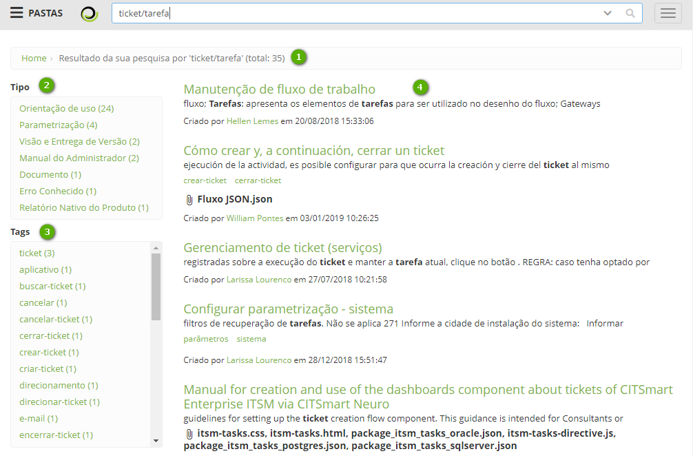
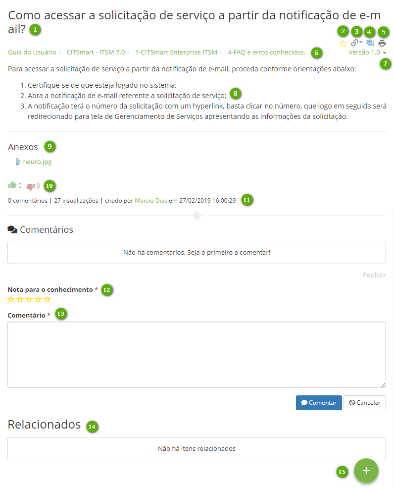

title: Portal do Conhecimento
Description: Visa fornecer informações relevantes que permitam ao operador (usuário ou administrador) o entendimento e aplicação de um determinado conhecimento.
#Portal do Conhecimento

O Portal do Conhecimento é uma das telas principais da solução, que visa
fornecer informações relevantes que permitam ao operador (usuário ou
administrador) o entendimento e aplicação de um determinado conhecimento.

Também possibilita que o mesmo registre um novo conhecimento, de modo a tornar o
portal dinâmico e atualizado.

   Figura 1 - Portal do Conhecimento
   
- 1: **Pastas** - exibe as pastas que o usuário logado tem acesso para
visualização dos conhecimentos das mesmas;

- 2: **Portal de Serviços** - ao clicar nesta opção, será apresentada uma das
telas principais do produto, o Portal de Serviços (Smart Portal);

- 3: **Sistema** - ao clicar nesta opção, permite entrar no sistema;

- 4: **Identificação do usuário logado** - ao clicar nesta opção, são exibidas
as funções para alterar a senha de acesso e sair do portal;

- 5: **Campo de pesquisa**: permite a busca por conhecimentos;

- 6: **Favoritos**: conhecimentos que foram marcados como favorito pelo o
usuário logado;

- 7: **Curtidos**: conhecimentos que foram curtidos pelo usuário logado;

- 8: **Indicados**: conhecimentos indicados ao usuário, referentes às
funcionalidades do sistema mais acessadas. Exemplo: o usuário logado acessa
sempre a funcionalidade de "Solicitação de Serviço", quando o mesmo entrar no
Portal do Conhecimento, o sistema irá indicar os conhecimentos referentes à
funcionalidade;

- 9: **Adicionar Conhecimento**: permite ao usuário logado registrar um novo
conhecimento na Base de Conhecimento.

   Figura 1 - Resultado de pesquisa

 - 1: Mostra a quantidade de conhecimentos encontrados;
 
 - 2: Tipo: mostra os tipos de conhecimentos encontrados, sendo possível refinar ainda mais a busca inicial ao selecionar uma das opções;
 
 - 3: Relação de conhecimentos encontrados.
 
!!! Abstract "REGRA"

    A lista resultante é montada de acordo com determinadas prioridades de comparações (configuráveis). Por default, toda lista             resultante será montada comparando o texto procurado com (nesta ordem): (a) conteúdo do conhecimento, (b) título, (c) anexos e (d)       palavras-chaves (Tags).
    
1.  Após encontrar o conhecimento desejado, clique no título para visualizar o
    conteúdo:

 

   Figura 3 - Visualizar conhecimento 

- 1:Título do documento

- 2:Ícone para favoritar o conhecimento para que ele seja relacionado na página principal do Portal do Conhecimento

- 3:Ícone para visualizar a quais módulos ITIL o conhecimento está vinculado

- 4:Ícone para deixar um comentário sobre o conhecimento

- 5:Ícone para imprimir o conhecimento

- 6:Caminho de pastas e sub-pastas para chegar a este conhecimento (migalha de pão)

- 7: Lista para acesso às versões do conhecimento

- 8: Lista de arquivos anexados ao conhecimento

- 9: Conteúdo do conhecimento

- 10: Ícones para registrar um "like" ou "unlike" sobre o conhecimento

- 11: Quantidade de comentários, visualizações, nome de quem criou o conhecimento, data e horário de sua última modificação

- 12: Estratégia de avaliação quantitativa do conhecimento (uma nota), que vai variar de 1 a 5, dependendo da estrela marcada

- 13: Local onde o usuário pode registrar seus comentários

- 14: Local onde serão listados todos os conhecimentos que tiverem sido relacionados com o conhecimento visualizado

- 15: Ícone para contribuir com a gestão de conhecimento da organização, ou seja, a maneira que o usuário tem para criar (propor) um novo conhecimento

!!! tip "About"

    <b>Product/Version:</b> CITSmart ESP | 8.00 &nbsp;&nbsp;
    <b>Updated:</b>02/27/2019 – Anna Martins

   

