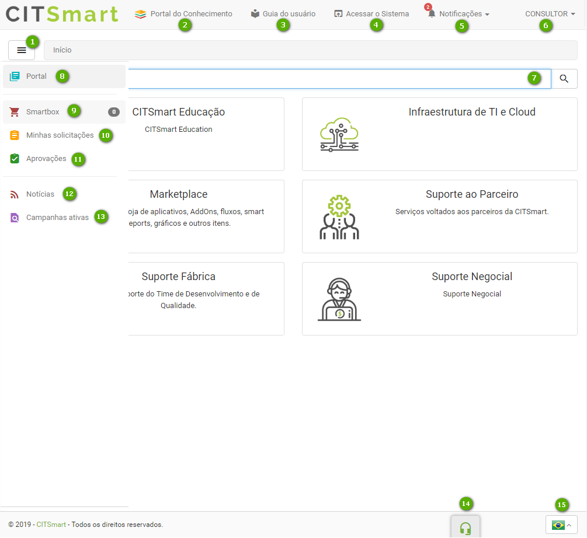

title:  Smart Portal
Description: O Smart Portal é um recurso da solução que disponibiliza o Catálogo de Serviços
#Smart Portal
O Smart Portal é um recurso da solução que disponibiliza o Catálogo de Serviços (Negócio e Apoio) aos usuários do sistema e permite realizar ações diversas, tais como: 

•	Abrir um ticket (solicitação de serviço);  
•	Receber notícias referentes ao Sistema;  
•	Avaliar a solicitação de serviço;  
•	Acesso aos conhecimentos referentes ao ticket para esclarecimento de dúvidas.  

Figura 1 - Smart Portal

- 1: Botão de menu - permite esconder/exibir o menu do Smart Portal

- 2: Portal do Conhecimento - atalho para Portal do Conhecimento, onde permite realizar a busca de informações relevantes do uso do sistema

- 3: Guia do Usuário - atalho para o Guia do Usuário, onde permite realizar a busca de informações relevantes

- 4: Acessar o Sistema - entrar no sistema

- 5: Notificações - local onde as mensagens de alerta do sistema são apresentadas

- 6: Identificação do usuário - são exibidas as funções para alterar o perfil e sair do sistema

- 7: Pesquisa - permite buscar os serviços disponíveis no portal

- 8: Portal - permite voltar à tela inicial do Smart Portal

- 9: Smartbox  - mostra a quantidade de solicitações que estão no carrinho de compras do usuário (opção ativa apenas quando parâmetro 292 estiver setado em "SIM")

- 10: Minhas solicitações - permite ao usuário logado visualizar suas solicitações de serviços e executar algumas ações nas mesmas;

- 11: Aprovações - permite visualizar somente as solicitações de serviços que requer aprovação

- 12: Notícias - local onde é disponibilizado as notícias, como por exemplo, referente à organização, ao sistema, etc

- 13: Investigações Ativas - permite buscar/acompanhar as atividades registradas

- 14: Chat - permite criar uma solicitação de serviço e interagir com o atendente sobre a mesma

- 15: Idioma - permite escolher o idioma que deseja para o sistema (Português, Inglês ou Espanhol)

Antes de começar 
-----------------

É necessário o cadastro prévio do contrato, a definição do tempo de atendimento
das atividades de requisição/incidente. É imprescindível também ter o portfolio
com os serviços e as atividades de requisição/incidente cadastrados e
disponibilizados no Smart Portal.

Procedimento 
-------------

1.  Acessar a funcionalidade através do menu principal Processos \> Gerência de
    Portfólio e Catálogo \> Smart Portal;

2.  Escolher o portfolio desejado e clicar sobre o mesmo. Será apresentado
    diversas ações que podem ser executadas em cada uma das abas desta tela. São
    elas:

    -   **Serviços**: Nesta aba será expostos as atividades registradas neste
    portfolio. Ao selecionar e clicar sobre a atividade pretendida, será
    possível registrar a solicitação de serviço (ticket) referente ao cenário
    encontrado, também é viável observar os conhecimentos referente ao ticket ao
    clicar na aba de mesmo nome, analisar as avaliações dos usuários referente
    as solicitações disponibilizadas ao clicar na aba “Avaliações” e ter acesso
    as notícias referente a solicitação em questão ao apertar a aba “Campanhas
    ativas”;

    !!! Abstract "NOTAS"  

        Os conhecimentos diponivéis na aba “Conhecimentos” do item “Serviço” podem ser
        definidos em dois níveis:

        -   Os conhecimentos que foram vinculados ao portfolio que estarão dispostos no 
        item “Relacionados ao Serviço”;

        -   Os conhecimentos que foram associados ao ticket ( adicionados quando o
        responsável pelo atendimento deste vinculou um artigo para difundir o 
        conhecimento da solução do mesmo) ordenados no item “Relacionados a 
        Requisição/Incidente.  

    -   **Conhecimentos**: Ao clicar sobre a aba, serão expostos os conhecimentos
    vinculados ao portfolio;

    -   **Campanhas ativas**: Esta aba expõem os questionários (coleta de
    informações) referente ao portfolio em questão.

3.  Ao clicar no ícone “Menu”, será exibido atalhos a algumas ações. É permitido
    visualizar as solicitação abertas pelo usuário ao apertar no ícone “Minhas
    solicitações”, visualizar as aprovações do ticket efetuadas pelo usuário,
    observar as notícias e campanhas ativas (questionários) referente a
    organização como um todo.  
    
!!! tip "About"  
    <b>Product/Version:</b> CITSmart ESP | 8.00 &nbsp;&nbsp;
    <b>Updated:</b>02/13/2019 – Larissa Lourenço  
   
