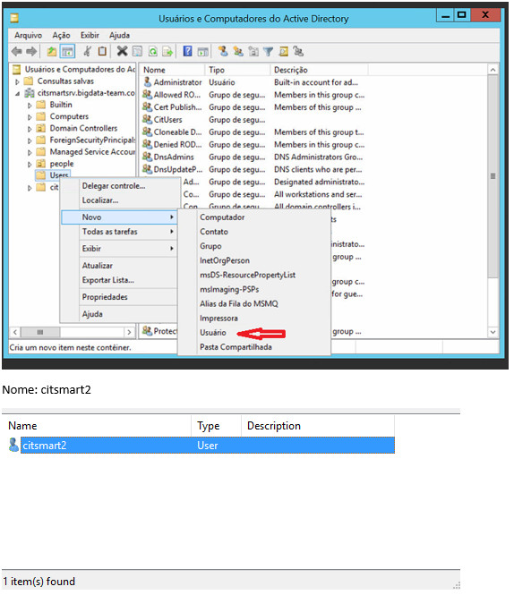
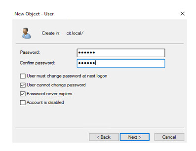
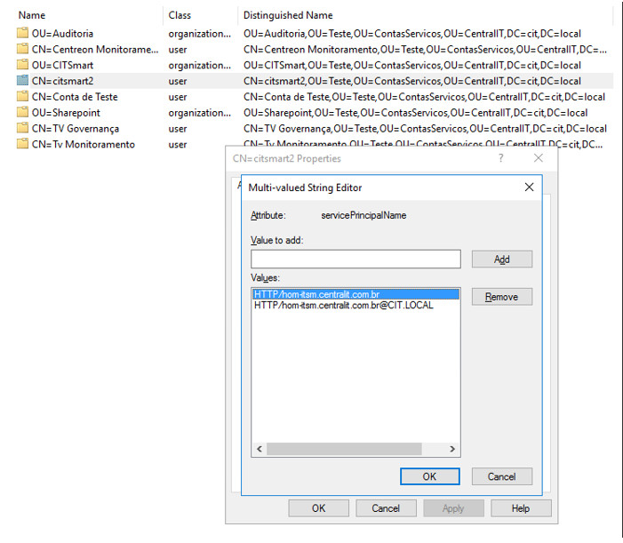
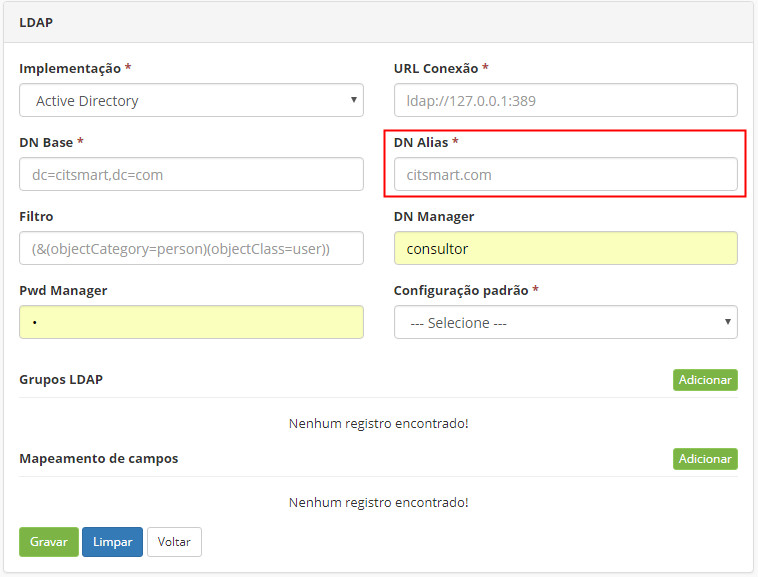

title: CITSmart auto-login
Description: CITSmart auto-login
#CITSmart auto-login


**Branchs**:

   Sso (itsm)

   Spnego 1.0 (artifactory)


Criar usuário AD
----------------

1.  Acessar criar usuário em Usuários e Computadores do Active Directory,
    conforme a figura abaixo:

    

     Figura 1 - Criar usuário

2. Criar uma senha: 

    

     Figura 2 - Senha

3. Clicar no lado direito do mouse, no botão usuário/propriedades:

    

     Figura 3 - Botão usuário/propriedades

4. Selecionar a opção "Esta conta oferece suporte para criptografia de 256 bits", aplicar e marcar "OK", conforme a figura abaixo:

    

     Figura 4 - Configurar conta


5.  Abrir o ADI Editar. Logo após, conectar no AD, clicar em usuários e
    localizar o usuário recém criado, conforme a figura abaixo:
      
    

     Figura 5 - Verificando usuário

6.  Clicar, então, o botão direito do mouse e selecionar a opção Propriedades.
    Logo após, procurar o **servicePrincipalName ** (sigla de SPN);

7.  Adicionar HTTP/hom-itsm.centralit.com.br, clicar em OK para efetuar a
    operação, conforme a figura abaixo:

    

     Figura 6 - Adicionar o valor

8.  Abrir o **CMD** como Administrador e colocar os seguintes comandos.
    Lembre-se que o primeiro seta o **SPN** e o segundo gera o Keytab (o que
    será utilizado no Wildfly):

    -   setspn -s HTTP/hom-itsm.centralit.com.br citsmart2

    -   ktpass / princ HTTP/hom-itsm.centralit.com.br /mapuser citsmart2  /pass
        central\@123 /ptype KRB5_NT_Principal/outcitsmart2.keytab /crypto ALL

9.  Realizado os passos acima, o **AD** estará configurado. 


Configurar o servidor Wildfly
-----------------------------

1.  Copiar o **war** gerado da branch **sso**;

2.  Copiar o arquivo krb5.conf (validar as informações de acordo com o AD) para
    a pasta standalone/configuration (wildfly):
    
    ```sh
    [libdefaults]
        
        default_tkt_enctypes = aes256-cts-hmac-sha1-96 aes128-cts-hmac-sha1-96 rc4-hmac
        
        default_tgs_enctypes = aes256-cts-hmac-sha1-96 aes128-cts-hmac-sha1-96 rc4-hmac
        
        permitted_enctypes = aes256-cts-hmac-sha1-96 aes128-cts-hmac-sha1-96 rc4-hmac
         
    [realms]
     
        citgosrv004.cit.local  = {
             
            kdc = citsmartsrv.citsmartsrv.bigdata-team.com
         
            default_domain = citsmartsrv.citsmartsrv.bigdata-team.com
         
        }
         
    [domain_realm]
     
        .citsmartsrv.citsmartsrv.bigdata-team.com = citsmartsrv.citsmartsrv.bigdata-team.com     
    ```
    
1.  Copiar o arquivo login.conf (validar as informações de acordo com o AD) para a pasta standalone/configuration (wildfly):

        custom-client {

            com.sun.security.auth.module.Krb5LoginModule required

            storeKey=true

            useKeyTab=true

            keyTab="file:///opt/wildfly-12.0.0.Final/standalone/configuration/lightkeytab.keytab"
  
            principal=HTTP/light-desenvolvimento.citsmartcloud.com\@CITSMARTSRV.BIGDATA-TEAM.COM;

        };

1.  Copiar o arquivo lightkeytab.keytab (gerado pelo comando no AD) para a pasta
    standalone/configuration (wildfly)

2.  Arrumar o standalone.xlm ao adicionar as seguintes informações:

    Em **\<system-properties\>**

    \<property name="sun.security.krb5.debug" value="true"/\>

    \<property name="java.security.krb5.kdc" value="CITSMARTSRV.BIGDATA-TEAM.COM"/\>

    \<property name="java.security.krb5.realm"value="CITSMARTSRV.BIGDATA-TEAM.COM"/\>

    \<property name="java.security.krb5.conf"value="/opt/wildfly-12.0.0.Final/standalone/configuration/krb5.conf"/\>

    \<property name="java.security.auth.login.config"value="/opt/wildfly-12.0.0.Final/standalone/configuration/login.conf"/\>

    \<property name="krb.keyTab"value="/opt/wildfly-12.0.0.Final/standalone/configuration/lightkeytab.keytab"/\>

    \<property name="krb.principal"value="HTTP/light-desenvolvimento.citsmartcloud.com\@CITSMARTSRV.BIGDATA-TEAM.COM"/\>

    Em **\<security-domains\>**

    \<security-domain name="spnego-server"\>

    \<authentication\>

    \<login-module code="com.sun.security.auth.module.Krb5LoginModule"flag="required"\>

    \<module-option name="storeKey" value="true"/\>

    \<module-option name="useKeyTab" value="true"/\>

    \<module-option name="keyTab" value="\${krb.keyTab}"/\>

    \<module-option name="principal" value="\${krb.principal}"/\>

    \<module-option name="isInitiator" value="false"/\>

    \</login-module\>

    \</authentication\>

    \</security-domain\>

    \<security-domain name="SPNEGO" cache-type="default"\>

    \<authentication\>

    \<login-module code="Kerberos" flag="required"\>

    \<module-option name="storeKey" value="true"/\>

    \<module-option name="refreshKrb5Config" value="true"/\>

    \<module-option name="useKeyTab" value="true"/\>

    \<module-option name="doNotPrompt" value="true"/\>

    \</login-module\>

    \</authentication\>

    \</security-domain\>

1.  Caso não tenha alterado o jar do policy do JAVA (JCE - Java Cryptography
    Extension), baixar os arquivos e colocar em
    jdk/jre/lib/security/policy/limited e jdk/jre/lib/security/policy/unlimited;

2.  Importar (sincronizar) usuários do LDAP no ITSM.

!!! Abstract "ATENÇÃO"

    O DN Alias deve ser igual ao domínio da rede (exemplo: CIT\\usuario), logo
    o DN Alias = CIT, conforme a figura abaixo:



   Figura 7 - Definir o DN

!!! Abstract "ATENÇÃO"

    É recomendável a leitura dos seguintes materiais de
    apoio: **<https://ss64.com/nt/setspn.html>** e **<http://spnego.sourceforge.net/>.
    
    
 !!! tip "About"

<b>Product/Version:</b> CITSmart ESP | 8.00 &nbsp;&nbsp;
<b>Updated:</b>03/15/2019 – Anna Martins
   
