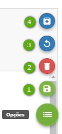

title: Criar conhecimento
Description: É possível criar, editar e pesquisar conhecimentos que vão desde o esclarecimento de uma funcionalidade até mesmo orientações mais técnicas.
#Criar conhecimento
É possível criar, editar e pesquisar conhecimentos que vão desde o esclarecimento de uma funcionalidade até mesmo orientações mais técnicas.
Um conhecimento permite a anexação de imagens, vídeos, anexos, links, entre outros recursos audiovisuais, tornando assim o compartilhamento de informações mais interativo.

Antes de começar
--------------------

Antes de criar um conhecimento é necessário criar pastas para sua inserção e
melhor organização. Assim fica mais fácil sua localização ao realizar uma busca.

Procedimento
----------------

1.  Acessar a funcionalidade pelo menu principal Processos \> Gerência de
    Conhecimento \> Conhecimento;

2.  Clicar no botão "Opções", localizado no canto inferior direito, logo em
    seguida em Adicionar novo conhecimento;
    
## Registro, Relacionamentos e Notificação

Figura 1 - Criar conhecimento

-   1: Cadastro - registrar o documento;

-   2: Documento Relacionado - permite vincular um conhecimento já existente ao
    documento que está sendo criado;

-   3: Item de Configuração - permite vincular um item de configuração;

-   4: Categoria de Ocorrência de Evento - permite vincular uma categoria de
    ocorrência;

-   5: Partes interessadas - selecione as partes (usuários ou grupos) que terão
    acesso ao conhecimento, sendo possível notificá-los;

-   6: Notificações - configura notificações da publicação, por e-mail e em
    tela.

    
!!! Abstract "ATENÇÃO"

    Para que a aba Item de Configuração esteja disponibilizada, o documento
    deverá estar salvo.
  
## Conformidade

Figura 2 - Guia Opções

*Opções*:

-   Ger. Disponibilidade: o conhecimento é referente ao Gerenciamento de
    Disponibilidade ou não;

-   Direitos Autorais: o conhecimento é referente a um direito autoral ou não;

-   Legislação: o conhecimento é referente a uma legislação ou não.

## Dados de Registro

Na guia Cadastro, são apresentados vários campos para preenchimento, entre eles:

-   Título: informar o título do conhecimento;

-   Situação: informar a situação do documento que será registrado;

-   Privacidade: definir a privacidade do conhecimento;

-   Confidencial: apenas o autor do conhecimento e o administrador da pasta terá
    acesso ao conhecimento;

-   Público: todas as pessoas terão acesso ao conhecimento, mesmo àqueles que
    não têm permissão na pasta;

-   Interno: somente as pessoas que têm permissão na pasta terão acesso ao
    conhecimento.

-   Data de expiração: informe a data de expiração que o conhecimento obedecerá.
    Quando atinge a data definida, o documento será automaticamente arquivado.

-   Conteúdo: descrever o texto do conhecimento:

    -   Para adicionar um link (hiperlink) ao conteúdo do conhecimento, no
        intuito de acessar um link externo, selecione uma palavra ou frase e
        clique no botão “Inserir/Editar link” (desenho de corrente), preencher
        os campos e clicar em “OK”;

    -   Para adicionar uma imagem ao conteúdo do conhecimento, clicar no botão
        “Imagem” (desenho de paisagem) ou copiar e colar a imagem salva em
        arquivo no computador;

    -   Para adicionar um vídeo, clicar no botão “Inserir um vídeo”:

        -   Na aba Vídeo do servidor: permite inserir um vídeo que está
            localizado no servidor de vídeos ou no computador;

        -   Na aba Embedded: permite inserir vídeos do Youtube. Ao acessar o
            vídeo clicar com o botão direito e selecionar “Copiar código de
            incorporação”.

!!! Abstract "ATENÇÃO"  

        Deve-se ter muito cuidado ao utilizar a privacidade “Público”, pois
        corre-se o risco de disponibilizar documentos de forma inadequada. Este
        cenário desconsidera a configuração de perfil de acesso e libera o acesso do
        documento a todos os usuários.

## Opções de publicação

Figura 3 - Botão Opções

   Ao ter um conhecimento já registrado, o botão “Opções” apresenta outras
  ações:

-   1: salva o conhecimento;

-   2: exclui o conhecimento;

-   3: limpa o documento que está aberto;

-   4: arquiva o documento que está aberto, tornando-o não visível no Portal de
    Conhecimentos.

    
 ## Outras opções  
 
 

Figura 3 - Botão Pesquisa
    
Botão Pesquisar – retorna tela principal de pesquisa de conhecimentos.  

!!! Warning "Versionamento"  

    Na criação do conhecimento o CITSmart estabelecerá sempre a versão "1.0" e, quando da alteração de um documento poderá ser
    indicado, pelo operador, se a alteração deve ser Versionada ou não e, também se as versões anteriores devem ser arquivadas.

!!! Abstract "ATENÇÃO"  

    **PRIVACIDADE** Deve-se ter muito cuidado ao utilizar a privacidade “Público”, pois
    corre-se o risco de disponibilizar documentos de forma inadequada. Este
    cenário desconsidera a configuração de perfil de acesso e libera o acesso do
    documento a todos os usuários.
        
    **SITUAÇÃO**, a Situação indica o Fluxo/Processo da criação(desenho) e aprovação/avaliação do Conhecimento até a sua publicação.  

Relacionado
--------------------

[Criar pasta](/pt-br/citsmart-platform-8/processes/knowledge/configuration/create-folder.html)

[Configurar acesso externo ao Portal do Conhecimento](/pt-br/citsmart-platform-8/processes/knowledge/configuration/configure-external-access-knowledge-portal.html)

<i class='fa fa-youtube-play  fa-2x' style='color:#97ce17;vertical-align: middle;'> </i> [Video Library](https://www.youtube.com/playlist?list=PLB5qK2uzf2RPwkqhQwYU_EpvvGd29tSTA)'

!!! tip "About"

    <b>Product/Version:</b> CITSmart Platform | 8.00 &nbsp;&nbsp;
    <b>Updated:</b>01/16/2019 – Larissa Lourenço
    
