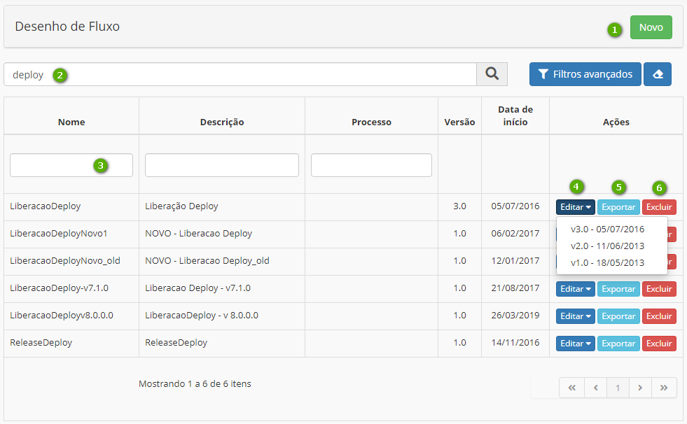
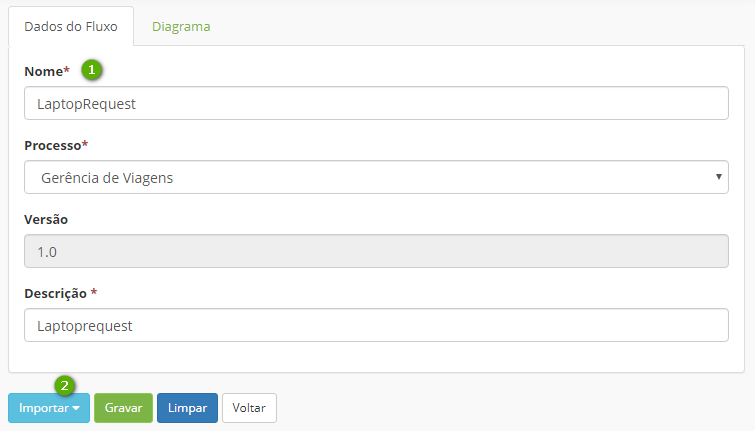
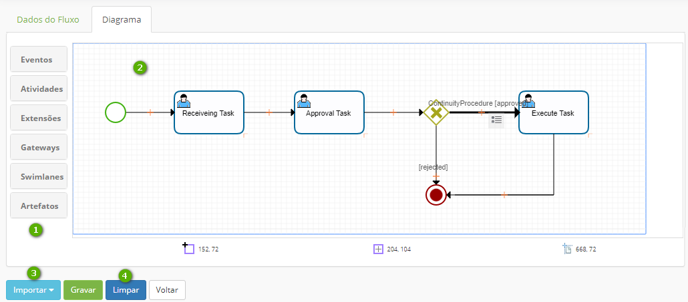

Title: Workflow

# Workflow

Apresentação
-----------

Fluxos são representações visuais de algo que se move continuamente. A funcionalidade de Fluxos tem a finalidade de modelar seus objetivos de negócio, descrevendo os passos que precisam ser executados para atingir esses objetivos através de um fluxo digital inteligente. É possível criar fluxos de trabalho para auxiliar na gestão de serviços, problemas, mudanças, liberações, ações de continuidade, requisições de viagens e compras. Sendo assim, o fluxo de trabalho possui interação com os principais processos do CITSmart.

## Interface

### Tela inicial

Figura 1 - Tela inicial

 - **1**: Novo - clicar para desenhar novo fluxo

 - **2**: Campo de busca - busca um fluxo pelo nome ou parte dele
 
 - **3**: Filtros - ao selecionar o botão "Filtros avançados" esses campos ficarão disponibilizados para busca
 
 - **4**: Editar - clicar para editar um fluxo já existente, sendo possível escolher qual versão será editada
 
 - **5**: Exportar - gera documento em formato JSON
 
 - **6**: Excluir - clicar para remover um fluxo

### Aba Dados do Fluxo

Ao clicar no botão “Novo” na tela inicial, a tela de cadastro do fluxo será disponibilizada na aba inicial de Dados do Fluxo.

Figura 2 - Dados do fluxo

 - **1**: Dados básicos para cadastro de um fluxo
  
 - **2**: Importar: é possível importar um fluxo já existente, nos formatos JSON e XML

### Aba Diagrama

Figura 3 - Diagrama

- **1** : Elementos para desenho de fluxo:
  
  **Eventos**: são os elementos de eventos que podem ser utilizados no desenho do fluxo:

  • Evento Início

  • Evento Intermediário de Envio de Link

  • Evento Intermediário de Captura de Link

  • Evento Intermediário de Temporizador

  • Boundary - Evento Intermediário de Captura de Erro

  • Evento Intermediário de Captura de Sinal

  • Evento de Finalização com Erro

  • Evento de Fim
  
  **Atividades**: são os elementos de atividades que podem ser utilizados no desenho do fluxo:

   • Tarefa de Usuário

   • Tarefa Script

   • Envio de Mensagem – E-mail

   • Business Rule Task

   • Tarefa de Serviço – ESI

   • Armazenamento de Dados

   • Subprocesso
   
   **Extensões**: são as extensões que podem ser utilizadas no desenho do fluxo:

   • Comunicação REST

   • Notificação

   • Atribuição de Variável

   • Conversação Watson
   
   **Gateways**: são os elementos de gateway que podem ser utilizados no desenho do fluxo:

   • Gateway Inclusivo

   • Gateway Paralelo

   • Gateway Exclusivo

   • Gateway Complexo

   • Gateway Baseado em Evento
   
   **Swimianes**: são os elementos de swimianes que podem ser utilizados no desenho do fluxo:

   • Pool/Participante

   • Lane
   
   **Artefato**: é o elemento de artefato que pode ser utilizado no desenho do fluxo:

   • Anotação de Texto
   

 - **2**: Campo de modelagem – espaço para desenho de fluxo de trabalho
 
 - **3**: Importar - é possível importar um fluxo já existente, nos formatos JSON e XML

 - **4**: Limpar – limpa o desenho de fluxo elaborado

### Aba Documentação

 - Visualização do desenho gerado na aba Diagrama

 - Descrição dos elementos utilizados no fluxo de trabalho gerado

 - Visualização dos documentos vinculados ao fluxo

### Botões

Figura 4 - Botões aba Documentação

 - **1**: Gravar:  
 
     •	Como nova versão: grava o desenho do fluxo como uma nova versão

     •	Na versão original: grava o desenho do fluxo na versão original, ou seja, a 1.0 – versão em desenho

 - **2**: Gerar Documentação: permite a exportação das informações do fluxo no formato PDF

Uso
---

[Criar um fluxo de trabalho](/pt-br/citsmart-platform-8/workflow/use/create-flow.html)

[Modelagem de processo](/pt-br/citsmart-platform-8/workflow/use/modeling.html)

[Configurar atividade de usuário no fluxo](/pt-br/citsmart-platform-8/workflow/use/user-task-configure.html)

Configuração
----------

[Expressões](/pt-br/citsmart-platform-8/workflow/configuration/expressions.html)

[Construir expressões](/pt-br/citsmart-platform-8/workflow/configuration/expressions-creator.html)

!!! tip "About"

    <b>Product/Version:</b> CITSmart Platform | 8.00 &nbsp;&nbsp;
    <b>Updated:</b>04/12/2019 - Anna Martins
