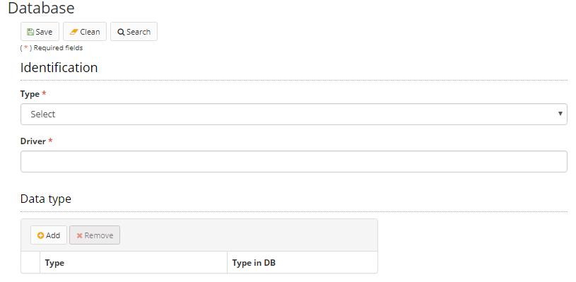

Title: Banco de dados  
Description:Através dessa tela é realizado o cadastro dos bancos de dados que são utilizados pelo Neuro.  

#Database  

Através dessa tela é realizado o cadastro dos bancos de dados que são utilizados pelo Neuro.    

##Como acessar    

1. Acesse a funcionalidade através da navegação no menu Neuro > Configuração > Banco de dados.    

##Pré-condições  

1. Não se aplica.  

##Filtros    

1. O seguinte filtro possibilita ao usuário restringir a participação de itens na listagem padrão da funcionalidade, facilitando a localização dos itens desejados:    

    * Palavra chave       
 
     
Figura 1 - Tela de pesquisa de banco de dados      
 
##Listagem de itens    
 
1. O seguinte campo cadastral está disponível ao usuário para facilitar a identificação dos itens desejados na listagem padrão da funcionalidade: Nome.  

    
Figura 2 - Tela de listagem de banco de dados    
 
##Preenchimento dos campos cadastrais    
1. Para cadastrar um banco de dados que não esteja na lista, clique em Cadastrar, conforme ilustrado na figura abaixo:    

        
    Figura 3 - Tela inicial de banco de dados    

2. Nesta tela também é permitido ao usuário outras ações. São elas:   
      - Para editar um item criado, selecione o item desejado, clique em Editar, faça as alterações, e acione Salvar.    
      - Para visualizar um item, selecione o mesmo e clique em Visualizar.    
      - Para remover um item criado, selecione o item desejado, clique em Remover e confirme a exclusão.    
  
3. Ao clicar em Cadastrar, será apresentada a seguinte tela:    

       
    Figura 4 - Tela de cadastro de banco de dados    

4. Informe o tipo do banco de dados, o caminho do driver e selecione os tipos de dado (Tipo de dado) que são aceitos pelo banco de dados cadastrado.    
5. Os tipos de banco de dados são pré-cadastrados na aplicação. 

6. Clique em Salvar para criar o banco de dados. Clique em Pesquisar para voltar para a tela anterior.    

!!! tip "About"
    <b>Updated:</b>07/02/2019 - João Pelles Junior
