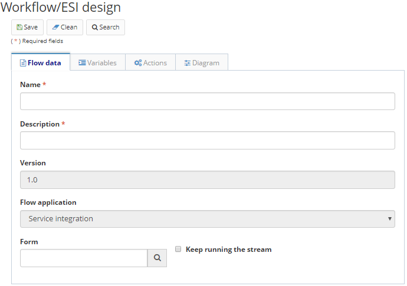

Title: Fluxo de integração de serviços  
Description:Os fluxos de integração de serviços, como o próprio nome diz, envolvem workflows executados com base em serviços de sistema, como integrações e conversões, por exemplo.   

#Fluxo de integração de serviços   
Os fluxos de integração de serviços, como o próprio nome diz, envolvem workflows executados com base em serviços de sistema, como integrações e conversões, por exemplo.   

##COMO ACESSAR    

1- Acesse a funcionalidade através do menu Neuro → Gerenciamento → Fluxo ESI.     

##PRÉ-CONDIÇÕES    

1- Não se aplica.   

##FILTROS  

1- O seguinte filtro possibilita ao usuário restringir a participação de itens na listagem padrão da funcionalidade, facilitando a localização dos itens desejados:   

- Palavra chave  

 
Figura 1 - Tela de pesquisa    

##LISTAGEM DE ITENS    

1- Os seguintes campos cadastrais estão disponíveis ao usuário para facilitar a identificação dos itens desejados na listagem padrão da funcionalidade: Nome, Descrição, Aplicação do fluxo, Versão e Data de bloqueio.   

   
Figura 2 - Tela de listagem     

##PREENCHIMENTO DOS CAMPOS CADASTRAIS - DADOS DO FLUXO   

Através dessa aba, são definidas informações básicas do fluxo que será desenhado.   

1- Para adicionar um novo fluxo, clique em Cadastrar→ Fluxo de serviços de integração, conforme ilustrado na figura abaixo:   

   
Figura 3 - Tela de registro   

2- Para cadastrar um novo dados do fluxo, clique em Adicionar.   
3- Será apresentada a seguinte tela:    

   
Figura 4 - Tela de cadastro/edição do workflow, aba de Dados do fluxo    

4- Informe um nome para o fluxo, uma descrição, qual formulário dará início ao fluxo (caso se aplique), e se persiste ou não a execução do fluxo. Caso o campo “Persiste a execução do fluxo” for marcado, o Neuro persistirá no banco de dados de toda instância da execução deste fluxo.    

5- O campo versão é incrementado automaticamente pelo sistema sempre que uma nova versão do workflow for criada.    

##VARIÁVEIS  

Nesta aba são configuradas as variáveis que serão utilizadas no fluxo desenhado. As variáveis são objetos capazes de reter e representar um valor ou expressão. As variáveis são associadas a "nomes", chamados identificadores, durante o tempo de execução do fluxo.  

1- Para adicionar uma variável, selecione a sua aba referente e clique em Adicionar.  
2- Será apresentada a seguinte tela:    

   
Figura 5 - Tela de cadastro/edição do workflow, aba de Variáveis     

3- Preencha os campos:    

- Nome da variável;
- Descrição;
- Se será armazenada no banco de dados;

	- Esta opção irá armazenar o valor da variável internamente, dentro do modelo de dados do Neuro, assim ela irá reter o valor durante a execução das tarefas

- Se é uma variável de retorno;

	- Esta opção irá fazer que o Neuro retorne a variável no final da execução do fluxo.

- Se é uma lista de valores;
- Se é uma variável de entrada na interface do fluxo;

	- Esta opção permite que a variável seja “injetada” no processo de negócio vinculado a este fluxo.

- Se é uma variável de saída na interface do fluxo;

	- Esta opção faz que a variável tenha o valor preenchida quando o processo de negócio vinculado à estre fluxo for executado.

- O tipo da variável;

	- Se for um objeto Java, informe a classe Java correspondente;
	- Se for um objeto de negócio, informe qual sua aplicação respectiva e qual o nome cadastrado do objeto de negócio;

- O valor inicial da variável, se constante ou script.

	- Se o valor for uma constante, este nunca será alterado durante a execução do fluxo, independente das operações realizadas pelo usuário.

4- To edit a variable, select the desired variable, click Edit, make the necessary changes, and click Update to complete the edit.  

5- To remove a variable flow, select the desired variable, click Remove, and confirm the deletion.  

!!! Abstract "ATTENTION"  

    **To save the changes effectively, click Save on the top bar.**  

##ACTIONS  

Through this menu, it is possible to register the actions that will be run in the workflow.  

The actions are based on scripts programmed in **Rhino** language.  

	1- To include an action, choose the tab for the same and then click go to Add.  
	2- The following screen will be displayed:  

   
Figure 6 - Register/edit workflow, actions tab 

3- Fill in the fields:  

- an **identifier** for the action;  
- the literal **name** for the action;  
- and the **script** that will be run when the action is triggered.  

4- To edit an action, select the action you want, click Edit, make the necessary changes, and click Update to complete the edit.  

5- To remove an action, select the action, click Remove, and confirm the deletion.  

!!! Abstract "ATTENTION"  

    **To save the changes effectively, click Save on the top bar.**  

##DIAGRAM  

The diagram of a service flow does not have the same **"Task"** components as a process flow. I.e., you cannot use the **"Human Task"** components for **"Sub Process Workflow"**.  

For a business process, we have, in addition, these components sections:  

- **Connectors**: components used to perform operations related to the database.  
- **Components**: varied components for performing various tasks.  
- **Transformers**: components for converting variable types.  
- **CITSmart**: components used for integration with an external Citsmart system.  

The other components present in the palette resemble the components of a "Process Flow". Further information regarding the functionality and use of each of the components can be found in the Developing Applications.  

1- To design a diagram, choose the tab for the same  
2- The following screen will be displayed:  

 
Figure 7 - Register/edit workflow, diagram tab

